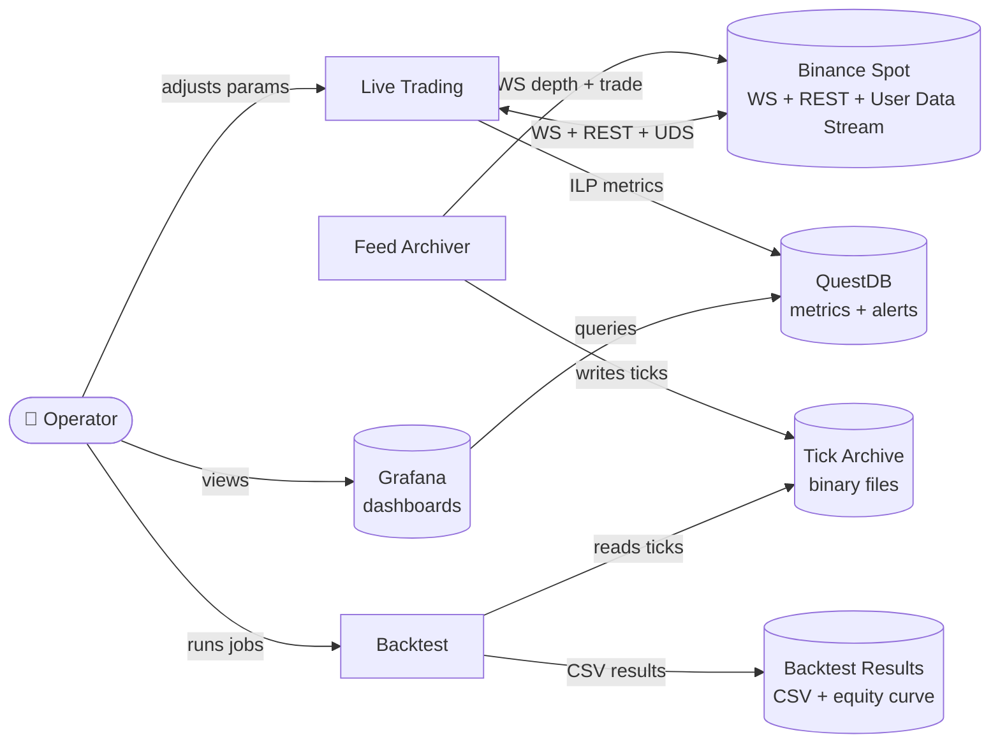

# Level 1 — System Context

The three top-level systems, the venue and stores they touch, and who operates them. Internals are for [level 2](../01-containers/).

## Context diagram

## Notes on the boundary

- **Three separate systems, not one box.** Feed Archiver, Live Trading, and Backtest run independently and don't share process state at runtime. They are related only by the Tick Archive (written by Feed Archiver, read by Backtest) and by the venue (Binance, touched by Feed Archiver and Live Trading in different ways).
- **Backtest does not touch Binance.** Only ticks from the archive.
- **Feed Archiver does not place orders.** Only reads market data and writes to the archive.
- **Live Trading does not touch the Tick Archive.** It runs off the live WS stream directly.
- **Binance is the only venue.** No cross-venue arbitrage, no smart order routing.
- **QuestDB and Grafana are off-the-shelf**, run as separate processes (typically in Docker), and are shown external to the trading codebase. They are for live observability only.
- **Backtest results are files, not QuestDB.** Each run produces a CSV of metrics + an equity curve, viewed offline. QuestDB is for live time-series only.
- **Tick Archive is a filesystem-shaped store** (binary tick files) surfaced through a data-manager layer that can resolve local paths or cloud storage. Both Feed Archiver (writer) and Backtest (reader) go through that layer.

## Not shown at this level

- Where each system physically runs (deployment view — level 2 or deployment doc)
- Internal components (see [level 3](../02-components/))
- Order lifecycle, tick flow, recovery sequences (see [level 4 — flows](../03-flows/))

## Next zoom

- [Level 2 — Containers](../01-containers/) — internals of Feed Archiver, Live Trading, Backtest.
