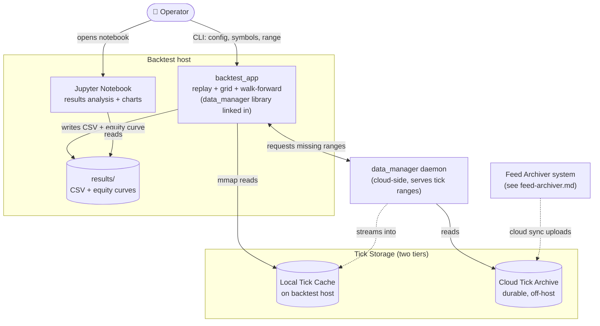

# Backtest — Containers

Zooms into the "Backtest" system from [Level 1](../00-context/) to show the runtime processes that replay historical ticks against a strategy, emit metrics, and feed analysis.

## Container diagram

## Containers

| Container | What it is | Talks to |
|-----------|------------|----------|
| **backtest_app** | Single binary that runs single-shot replays, parameter grid sweeps, and walk-forward optimisation — the `BacktestEngine`, `FillSimulator`, `MetricsCollector`, `ParameterGrid`, and `WalkForwardOptimization` all live inside this one process, driven by CLI flags. Links the client-side `data_manager` library in-process for tick resolution. | data_manager daemon (over network), Local Tick Cache (mmap reads), Results (writer) |
| **Jupyter Notebook** | Analysis surface. Reads CSVs and equity curves out of `results/` and produces charts, comparisons, and post-hoc statistical work. Not part of the backtest run itself — separate step, run interactively by the operator. | Results (reader) |
| **data_manager daemon** | Runs on the cloud side. Serves tick-range requests from any Backtest host. Reads from the durable Cloud Tick Archive on the cloud side, streams the requested range down to the client's Local Tick Cache. The client-side counterpart is a library linked into `backtest_app`, not a separate process. | Cloud Tick Archive (reader), Backtest hosts (serves) |
| **Local Tick Cache** | On-disk binary tick cache on the Backtest host. Populated on demand by the data_manager daemon in response to `backtest_app`'s requests. Same on-disk format as what the Feed Archiver produces — mmap-friendly binary. | data_manager daemon (writer via stream), backtest_app (mmap reader) |
| **Cloud Tick Archive** | Durable off-host storage of the tick corpus written by the Feed Archiver. Read only from the Backtest side, and only through the data_manager daemon. | data_manager daemon (reader), Feed Archiver hosts (writer, from [feed-archiver.md](feed-archiver.md)) |
| **Results** | CSV of run metrics (Sharpe, Sortino, Calmar, drawdown, fill stats, PnL) plus equity curve and trade journal. One directory per run. | Operator (via Jupyter or direct read) |

## Key protocol lines

- **Operator → backtest_app:** CLI. Each run is a fresh process; no daemon on the client side.
- **backtest_app → data_manager daemon:** Network protocol (TCP-shaped). `backtest_app` requests `(symbol, from, to)` ranges through the linked-in library, which forwards to the cloud daemon. Blocks until the requested range is streamed into the local cache.
- **data_manager daemon → Cloud Tick Archive:** Reads packaged tick files from cloud storage. One-way (this system reads; the Feed Archiver side writes).
- **backtest_app → Local Tick Cache:** `mmap` reads. Binary search seek to the starting timestamp, sequential scan.
- **Jupyter → Results:** Direct file read. Pandas / whatever library the notebook uses.

## Deliberately not here

- **QuestDB / Grafana.** Backtest metrics are files, not time-series. QuestDB is for live observability only.
- **Any connection to Binance.** Backtest never touches the live venue.

## Not shown at this level

- Internal component structure of `backtest_app` — `BacktestEngine`, `FillSimulator`, `MetricsCollector`, `VirtualTimeManager`, `TickDataReader`, `ParameterGrid`, `WalkForwardOptimization`. See [Level 3](../02-components/backtest/).
- Internal structure of the data_manager daemon (its own components — request queue, cache index, cloud read pool). See its own Level 3 or a data-manager-specific doc.
- Whether multiple Backtest hosts run in parallel against one cloud daemon (fan-in). See flows if relevant.

## Next zooms

- [Level 3 — Backtest components](../02-components/backtest/) — internals of `backtest_app`.
- [Feed Archiver containers](feed-archiver.md) — the writer side of the Cloud Tick Archive.
