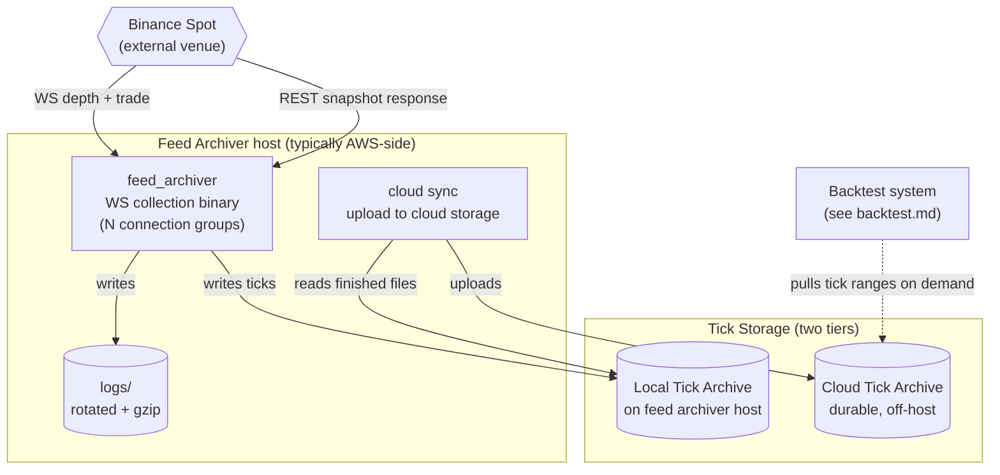

# Feed Archiver — Containers

Zooms into the "Feed Archiver" system from [Level 1](../00-context/) to show the runtime processes that record Binance market data to durable storage.

## Container diagram

## Containers

| Container | What it is | Talks to |
|-----------|------------|----------|
| **feed_archiver** | Single binary that maintains N Binance WebSocket connections (one per configured connection group). Bootstrap protocol pulls a REST snapshot in parallel, buffers WS diffs, transitions from `BUFFERING` to `LIVE` when the sync condition is met. 10ms trade reorder window handles out-of-order `@trade` IDs from Binance matching-engine shards. Writes normalised ticks to local disk. | Binance (WS + REST), Local Tick Archive (writer), logs |
| **cloud sync** | Scheduled process that uploads finished tick files from the local archive to the cloud archive. Cadence depends on the setup — typically periodic (cron / systemd timer). Whether this is a bespoke process, a shell script wrapping a sync tool, or something else, is a deployment detail. | Local Tick Archive (reader), Cloud Tick Archive (writer) |
| **Local Tick Archive** | Filesystem directory of binary tick files, one per symbol per period. Written by `feed_archiver` (live), read by cloud sync (for upload). | See above |
| **Cloud Tick Archive** | Durable off-host storage. Source of truth for Backtest hosts that don't have local ticks. Read from Backtest side through the data_manager daemon. | cloud sync (upload from this side), data_manager daemon (read from Backtest side — see [backtest.md](backtest.md)) |

## Key protocol lines

- **feed_archiver → Binance:** WS for depth and trade streams (one connection per group), REST for initial snapshots during bootstrap.
- **feed_archiver → Local Tick Archive:** Direct file writes, one file per (symbol, period). Binary format with a 64B-aligned header for mmap-friendly reads on the backtest side.
- **cloud sync → Cloud Tick Archive:** Scheduled upload. One-way from this host (this side writes; the Backtest side reads).

## Not shown at this level

- Internal component structure of `feed_archiver` — the per-group `WS client + MessageQueue + BinanceParser + worker thread`, the `BinanceFeedManager`, `FeedContext`, `SymbolRecorder`, and the bootstrap coordinator. See [Level 3](../02-components/feed-archiver/).
- Deployment: which region / VM size / systemd unit vs bare process.
- The reader path from Cloud Tick Archive back down to a Backtest host — that lives in [backtest.md](backtest.md) and forms the shared surface between the two systems.

## Next zooms

- [Level 3 — Feed Archiver components](../02-components/feed-archiver/) — internal structure of the binary.
- [Backtest containers](backtest.md) — the reader side of the Tick Archive.
- [Live Trading containers](live-trading.md) — sibling system.
