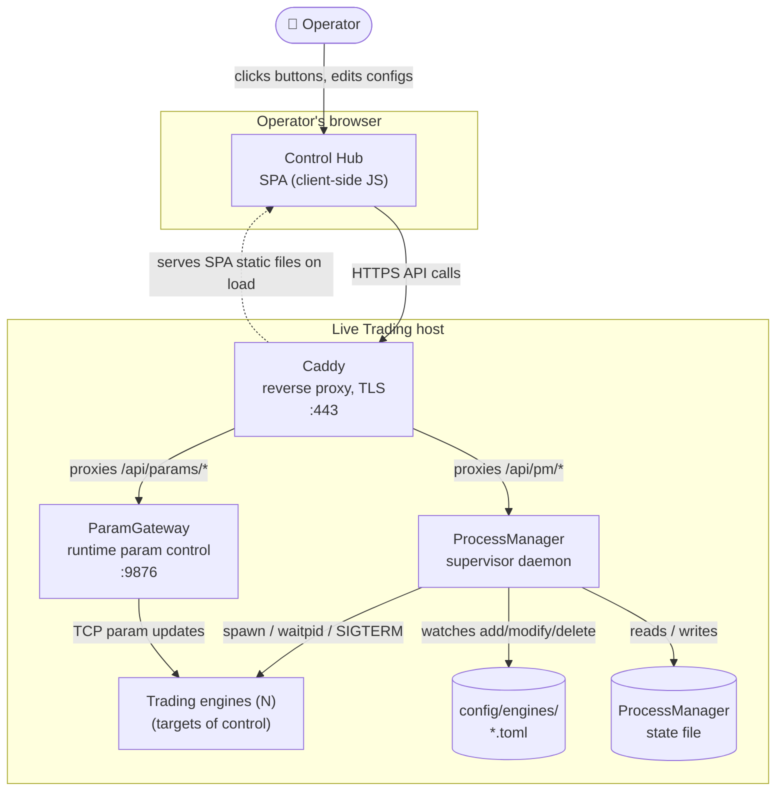
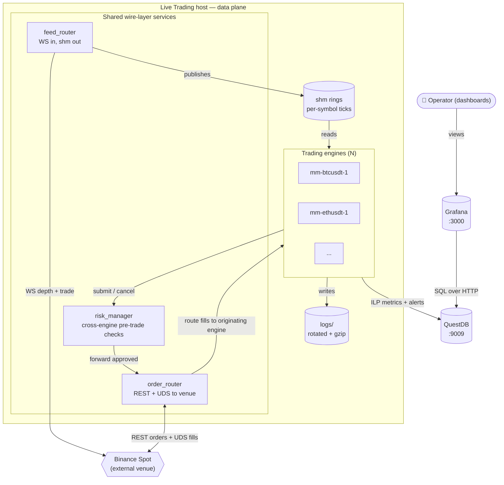

# Live Trading — Containers

Zooms into the "Live Trading" system from [Level 1](../00-context/) to show the runtime processes on a Live Trading host and how they coordinate.

The diagrams are split by concern: a **control plane** (how the operator manages the system) and a **data plane** (how market data and orders flow through the system). The trading engines appear in both — the control plane sees them as targets of lifecycle and configuration operations, the data plane sees them as the compute doing the trading work.

## Control plane

Everything an operator touches to manage the fleet: reverse proxy, admin UI, supervisor, param control, and the config files those services watch.

## Data plane

Everything on the hot path: the venue, the shared wire-layer services, the engines, and the observability sinks the engines write to.

## Containers

| Container | What it is | Talks to |
|-----------|------------|----------|
| **Caddy** | Reverse proxy + TLS terminator on :443. Fronts all operator-facing HTTP endpoints. | Control Hub (serves static), ProcessManager (proxies API), ParamGateway (proxies), Grafana (proxies) |
| **Control Hub** | Static SPA (single-page admin UI). Served by Caddy. Talks to backend services via Caddy-proxied APIs. | Operator (in browser) |
| **ProcessManager** | Supervisor daemon. Spawns and watches engine processes via `waitpid()`. Watches `config/engines/` directory for TOML changes and reacts (add → spawn, modify → SIGTERM + respawn, delete → SIGTERM + cleanup). Maintains engine state file. | Filesystem (config, state), engines (spawn/signal), logs |
| **ParamGateway** | TCP server on :9876. Receives runtime parameter change commands from the operator (via Control Hub) and forwards them to the right engine. Uses UDP discovery so engines self-register. | Engines (TCP param updates) |
| **feed_router** | Holds the WS connections to Binance. Normalises depth + trade messages into ticks and publishes them into per-symbol shared-memory rings. Engines never touch the venue for market data directly. | Binance (WS), shm rings (writer) |
| **risk_manager** | Cross-engine pre-trade check. Engines send submit/cancel intents here; risk validates against exposure limits, kill switch state, and any other cross-engine rules; approved orders forwarded to `order_router`. | Engines (upstream), order_router (downstream) |
| **order_router** | Holds Binance REST connection and the User Data Stream. Forwards approved orders to the venue, routes acknowledgements and fills back to the originating engine. | risk_manager (upstream), Binance (REST + UDS), engines (fills back) |
| **Trading engine** (N instances) | The `trading_system` binary, one process per engine config. Reads ticks from shm, applies its strategy, submits orders to risk_manager, writes metrics to QuestDB, logs locally. | shm rings (reader), risk_manager (submit), order_router (fills back), QuestDB (ILP), ParamGateway (as target), filesystem (logs) |
| **QuestDB** | Time-series store for metrics and alerts. Off-the-shelf, typically Docker. External at Level 1; still external here in the sense that it's not part of the trading codebase. | Engines (writers), Grafana (reader) |
| **Grafana** | Dashboards over QuestDB. Off-the-shelf. | Operator (via Caddy-proxied :3000), QuestDB (reader) |

## Filesystem-shaped containers

| Path | Written by | Read by | Notes |
|------|-----------|---------|-------|
| `config/engines/*.toml` | Operator (via Control Hub → Caddy → ProcessManager) or by hand | ProcessManager (watches directory), engines (on start) | Atomic writes via `tmp + rename` to avoid partial reads |
| `logs/{engine_id}.log` | Engines | Operator (via Control Hub grep), ProcessManager (parses events) | Daily rotation, gzip after rotate, delete after 7 days |
| `logs/processmanager.log` | ProcessManager | Operator | Same rotation policy |

## Key protocol lines

- **Operator → Caddy:** HTTPS on :443. All operator interaction goes through here.
- **ProcessManager → Engine:** POSIX process lifecycle. Spawn via `fork+exec`, watch via `waitpid(WNOHANG)`, stop via SIGTERM (5s grace) then SIGKILL.
- **ParamGateway → Engine:** TCP text protocol. Engines self-register via UDP announcement on start; ParamGateway holds their addresses in a live map.
- **feed_router → Binance:** WS for depth + trade streams. Normalises and publishes ticks to shm rings.
- **feed_router → Engines:** Shared-memory rings, one ring per symbol. Non-blocking reads on the engine side.
- **Engine → risk_manager:** IPC (TCP, unix socket, or shm mailbox) for submit/cancel intents.
- **order_router ↔ Binance:** REST for order submission, WebSocket User Data Stream for fills and account events.
- **Engine → QuestDB:** ILP (InfluxDB Line Protocol) over TCP. Non-blocking SPSC queue from hot path to a background TCP writer thread.

## Not shown at this level

- Internal component structure of the trading engine (MarketFeed, OMS, RiskManager, KillSwitch, strategies) — see [Level 3](../02-components/live-trading/).
- Deployment topology (which host, which region, Docker vs bare metal) — separate deployment doc.
- Cross-cutting sequences like an order's full lifecycle from strategy submit through Binance ack to position update — see [Level 4](../03-flows/).

## Next zooms

- [Level 3 — Live Trading components](../02-components/live-trading/) — internals of the trading engine binary.
- [Feed Archiver containers](feed-archiver.md) — TBD.
- [Backtest containers](backtest.md) — TBD.
