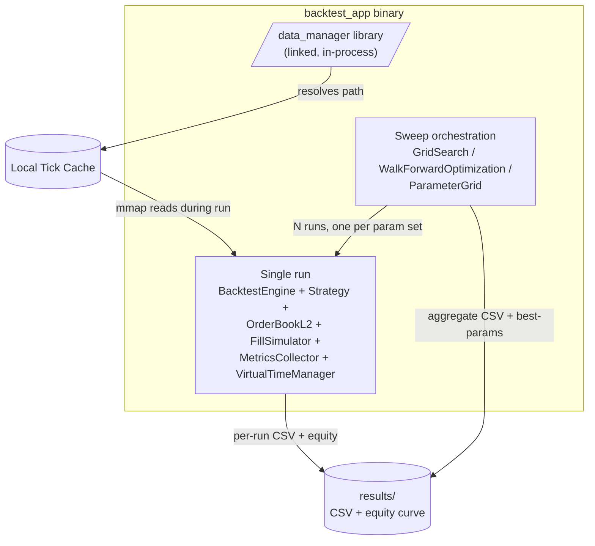
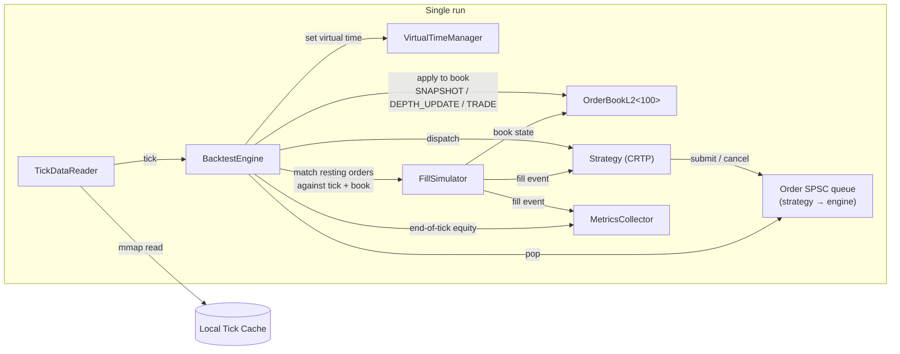
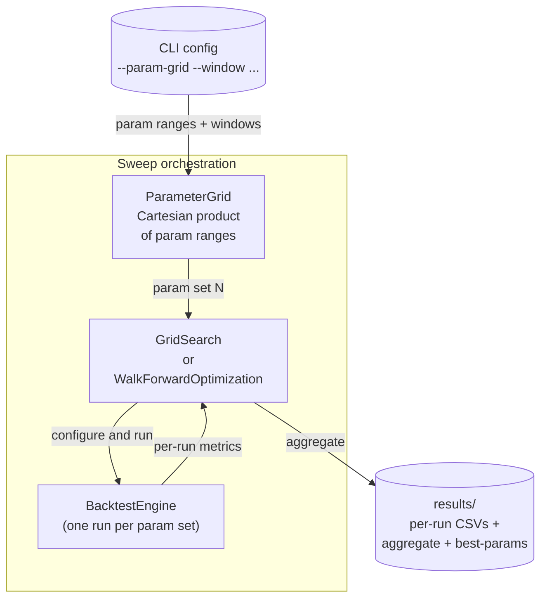

# backtest_app — Components

Zooms into the `backtest_app` binary from [Level 2](../01-containers/backtest.md) to show the internal components that replay historical ticks against a strategy and emit metrics.

Three diagrams, same pattern as [feed_archiver](feed-archiver.md): a structural overview, the single-run tick flow, and the grid-search / walk-forward orchestration that wraps around it.

## 1. Component overview

Structure only. The run pipeline is collapsed to a single box (unpacked in diagram 2), and sweep orchestration is one box (unpacked in diagram 3).

## 2. Single-run tick flow

One tick's path through the system in a single-run replay. Deterministic — same input, same output.

**Snapshot bootstrap detail:** `SNAPSHOT` ticks at the head of a tick file are buffered by the engine, not dispatched to the strategy. When the first `DEPTH_UPDATE` arrives, `process_snapshot()` flushes the buffered snapshot into `OrderBookL2` and only then does normal tick dispatch begin. This mirrors the live bootstrap idea: don't run strategy logic on an incomplete book.

**Deterministic clock:** `VirtualTimeManager` holds an atomic timestamp advanced only by the tick loop. Nothing in the system reads wall time during a run. Two runs with identical inputs and parameters produce byte-identical results.

## 3. Grid search and walk-forward orchestration

Sweeps and out-of-sample validation. Runs many single-run replays and aggregates their metrics.

**GridSearch** iterates every combination the `ParameterGrid` produces, runs one full replay per combination, collects the metric bundle from each `MetricsCollector`, and writes an aggregate CSV plus a best-params summary.

**WalkForwardOptimization** does the same but splits the tick range into rolling (train, test) windows. Best params are chosen on the train window, then evaluated on the immediately-following test window, avoiding in-sample overfitting.

## Components

| Component | What it does |
|-----------|--------------|
| **BacktestEngine** | Main loop. Templated on `Strategy` — CRTP dispatch, no vtable. Reads ticks from `TickDataReader`, advances `VirtualTimeManager`, applies ticks to `OrderBookL2`, dispatches to the strategy, pops the strategy's order queue, calls `FillSimulator` to match, forwards fills to the strategy and to `MetricsCollector`. |
| **TickDataReader** | mmap reader over the binary tick file format (same as what `feed_archiver` writes — 64B-aligned header). Supports binary-search seek to a starting timestamp, then sequential scan. Zero-copy path from disk cache to consumer. |
| **VirtualTimeManager** | Deterministic clock. Atomic timestamp advanced only by the tick loop. Anything in the run that needs "now" reads from here, not from wall time. Two identical runs produce byte-identical results. |
| **Strategy** (CRTP) | The trading logic. `BaseStrategy<Derived>` template with `on_tick_impl`, optional `on_timer_impl`, `set_parameter_impl`, `on_order_rejected_impl`, `dump_params_impl`. Concrete strategies (e.g. `MarketMakerBase`, `SimpleMarketMaker`) derive from this. Submits orders through a per-strategy SPSC queue shared with the engine via constructor reference. |
| **OrderBookL2\<100\>** | Bounded L2 order book, 100 levels deep. Sorted-vector implementation, SeqLock for thread safety. Updated by the engine from `SNAPSHOT` and `DEPTH_UPDATE` ticks. Read by `FillSimulator` and the strategy. |
| **FillSimulator** | Matches strategy orders (limit and market) against the current book and incoming ticks. Handles partial fills, maker vs taker fee application. Produces fill events forwarded to strategy and metrics. |
| **Order SPSC queue** | Single-producer (strategy) single-consumer (engine) ring buffer for strategy → engine order submission and cancellation. Constructed once, shared by reference. Non-blocking on both sides. |
| **MetricsCollector** | Records fills, computes running equity curve, produces 25+ metrics at end of run — Sharpe, Sortino, Calmar, max drawdown, win rate, average holding time, fill stats. Writes CSV + equity curve. |
| **ParameterGrid** | Cartesian product generator over parameter ranges declared in config. Iterator interface. |
| **GridSearch** | Templated `run<Strategy>()`. Iterates the ParameterGrid, launches one BacktestEngine run per param set (serial or parallel depending on the parallel-backtest audit), aggregates metrics. |
| **WalkForwardOptimization** | Templated `run<Strategy>()`. Same as GridSearch but with rolling (train, test) windows for out-of-sample validation. |
| **data_manager library** | In-process resolver. Given a `(symbol, from, to)` request, returns a local file path — checking the local cache and pulling from the cloud data_manager daemon if the range isn't already local. Blocks until the requested range is available. See [Level 2](../01-containers/backtest.md). |

## Deliberately not here

- Fill model details (maker/taker fee schedules, slippage assumptions) — belong to `FillSimulator`'s own docs.
- Specific strategy implementations (MarketMakerBase quoting logic, TWAP scheduling) — those get their own doc if they need one.

## Not shown at this level

- Class-level structure of any single component — read the source.
- Distributed / parallel sweep topology across multiple hosts — a scaling doc.
- The cloud-side data_manager daemon internals — see its own components zoom (TBD).

## Next zooms

- trading_system components — TBD.
- [Level 4 — Flows](../03-flows/) — a full order-lifecycle sequence would live there, spanning strategy submit → engine → fill sim → metrics.
