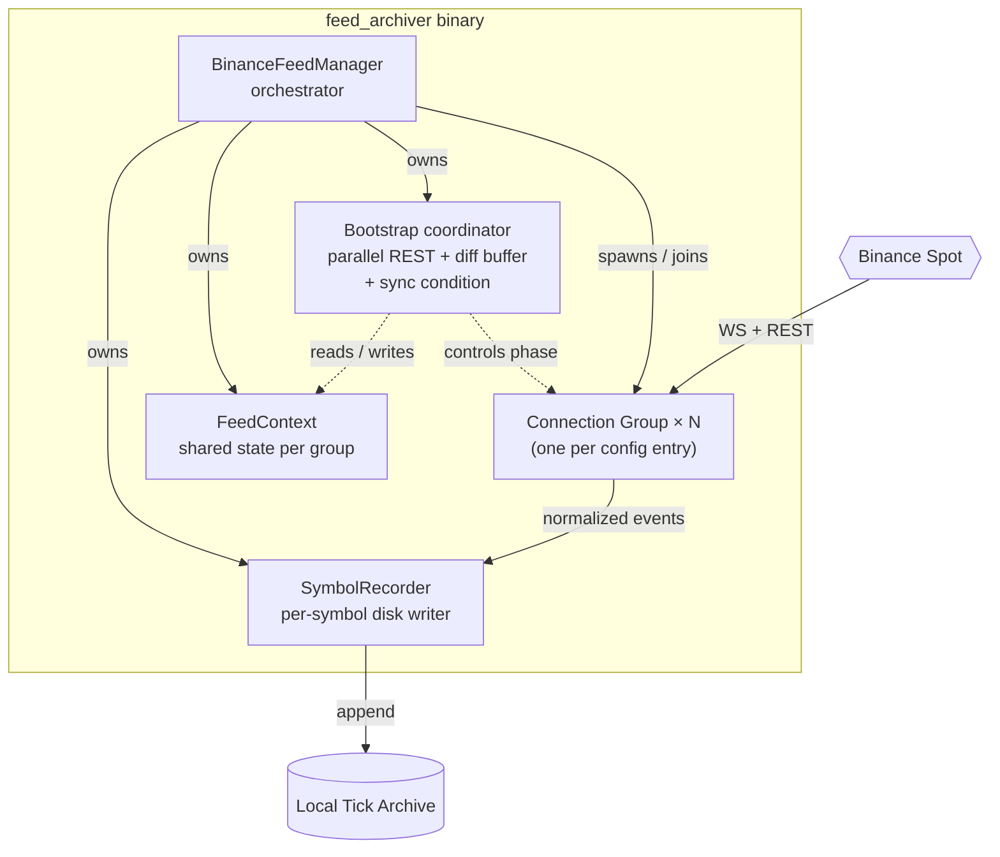
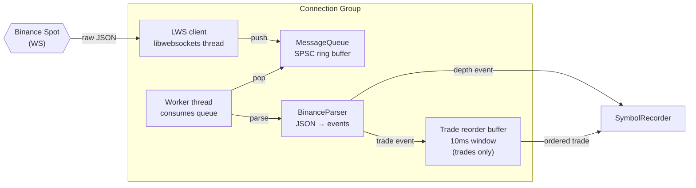
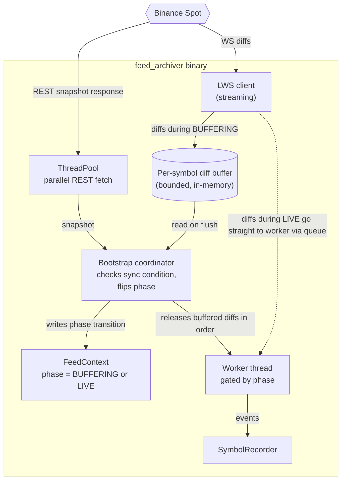

# feed_archiver — Components

Zooms into the `feed_archiver` binary from [Level 2](../01-containers/feed-archiver.md) to show the internal components that turn a WebSocket stream + REST snapshot into ordered ticks on disk.

Three diagrams, each doing one job: a structural overview, a zoom into a single Connection Group's pipeline, and the bootstrap flow that gets each group from `BUFFERING` to `LIVE`.

## 1. Component overview

Top-level structure with Connection Groups collapsed. Shows what the orchestrator owns and how the pieces relate.

## 2. Inside a Connection Group

One group's internal pipeline. There are N of these in the binary, isolated from each other — failure in one doesn't stop others.

## 3. Bootstrap phase (BUFFERING → LIVE)

On group start each Connection Group is in `BUFFERING` phase. WS diffs stream into a per-symbol buffer while a REST snapshot fetch runs in parallel on the ThreadPool. When the snapshot arrives, the sync condition is checked; on success, the phase flips to `LIVE` and buffered diffs are drained.

**Sync condition:** for the depth stream, a snapshot with `lastUpdateId = L` is compatible with a WS diff `[U, u]` if `U ≤ L+1 AND u ≥ L+1`. Bootstrap holds diffs in the per-symbol buffer until this is satisfied. If the snapshot fetch fails, the coordinator escalates to a kill signal for the group.

## Components

| Component | What it does |
|-----------|--------------|
| **BinanceFeedManager** | Top-level orchestrator. Reads `[[archiver.connections]]` from config, spawns one Connection Group per entry, owns Bootstrap coordinator, SymbolRecorder, and FeedContext. On shutdown, joins worker threads first (drain queues), then disconnects WS clients — ordering avoids WS callbacks firing into joined workers. |
| **Connection Group** | Isolated pipeline for one WebSocket connection. N of these, one per configured group. Each holds its own LWS client, MessageQueue, worker thread, and BinanceParser. Failure in one doesn't affect others. |
| **LWS client** | Wraps libwebsockets. Runs on its own thread (per-group `binance-ws-N`). Receives raw WS messages from Binance and pushes into MessageQueue via lock-free SPSC. Never blocks. LwsAnchor → LwsService → LwsConnection ownership model (see `include/network/CLAUDE.md`). Service timeout tuned to 1 ms per group to avoid update pileup during bursts. |
| **MessageQueue (SPSC)** | Bounded single-producer single-consumer ring between the LWS thread (producer) and the worker thread (consumer). Non-blocking on both sides. |
| **Worker thread** | Consumes messages, calls BinanceParser, routes normalized events downstream. One per group. During BUFFERING the worker is gated by phase — events flow into the diff buffer instead of straight to SymbolRecorder. |
| **BinanceParser** | Stateless JSON → normalized-event translator. Depth-diff messages produce one event per level, so the consumer must handle the emitted buffer. |
| **Trade reorder buffer** | Bounded 10 ms delay window for `@trade` events. Binance's matching engine is sharded, so trade IDs can arrive slightly out of order; the buffer holds and re-orders. Not applied to depth (depth uses `update_id` for sequencing). |
| **Bootstrap coordinator** | Runs the REST snapshot fetch in parallel with the WS diff buffering, checks the sync condition on snapshot arrival, transitions phase from BUFFERING to LIVE, flushes buffered diffs in order. Kills the group on fetch failure. |
| **SymbolRecorder** | Per-symbol writer. Formats normalized events into the binary tick file layout (64B-aligned header, mmap-friendly), rotates files, appends to `Local Tick Archive`. Same on-disk format read by Backtest via `data_manager`. |
| **FeedContext** | Shared per-group state — parsed config, current phase, sequence tracking for gap detection. Passed by reference. |
| **ThreadPool** | General-purpose pool used by Bootstrap for parallel snapshot fetches. Not per-group; shared across all groups. |

## Deliberately not here

- Binance JSON schema and per-message field details — a venue concern, lives near `BinanceParser` in code.
- libwebsockets internals (event loop, SSL, poll behavior) — see `include/network/CLAUDE.md`.

## Not shown at this level

- Class-level structure (constructors, member layouts, exact signatures). Read the source for that.
- The reader side that consumes the produced tick files — see [Level 2 backtest](../01-containers/backtest.md) and backtest components (TBD).

## Next zooms

- trading_system components — TBD.
- [Level 4 — Flows](../03-flows/) — a full gap-recovery sequence would live here, spanning `BUFFERING → LIVE` and a mid-flight WS gap.
