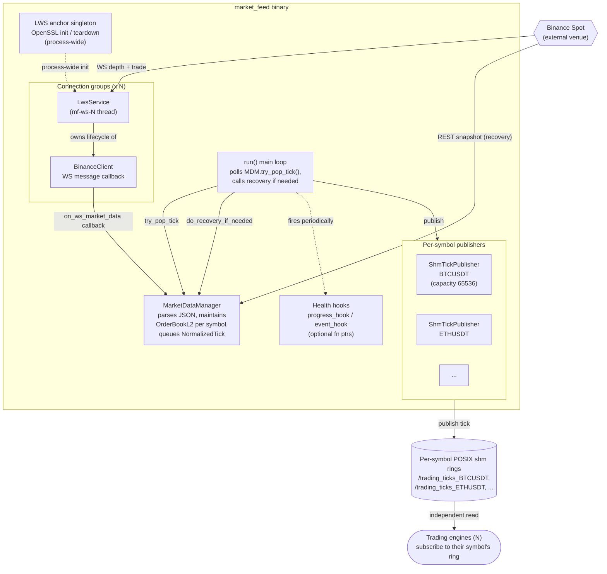

# market_feed — Components

Zooms into the `market_feed` (a.k.a. `feed_router`) container from [Level 2 live-trading](../01-containers/live-trading.md). Standalone process that owns the WebSocket connections to Binance for the live-trading side, maintains order books, and publishes normalized ticks into per-symbol POSIX shared-memory rings that trading engines read.

## Component diagram

## Components

| Component | What it does |
|-----------|--------------|
| **MarketFeed** | Standalone process. Owns everything below. Constructs from `engine::TradingConfig`. Two-phase lifecycle: `initialize()` sets up connection groups, publishers, and MDM; `run()` blocks on the main tick-drain loop until `request_stop()` or signal. |
| **Connection group (× N)** | One `LwsService` + one `BinanceClient` per configured connection group. Each `LwsService` owns its own `lws_context` and service thread (named `mf-ws-N`). Groups are isolated — a failure in one doesn't stop the others. |
| **LwsService** | Wraps libwebsockets. Runs on its own thread. Receives raw WS messages from Binance and hands them to `BinanceClient` via callback. Service timeout tuned to 1 ms per group to avoid update pileup during bursts. |
| **BinanceClient** | Symbol-aware wrapper for the WS connection. Handles connect/reconnect state, subscribes to the configured symbol streams, forwards raw messages to `MarketDataManager` via `on_ws_market_data`. |
| **LWS anchor singleton** | Process-wide OpenSSL init and teardown. Every `LwsService` context requires `DO_SSL_GLOBAL_INIT`; the anchor ensures this happens once across all connection groups regardless of construction order. Fix from commit 062d2e0 in the main repo. |
| **MarketDataManager (MDM)** | Central parser + book maintainer. Parses Binance JSON, maintains `OrderBookL2<N>` for each configured symbol, validates sequence on `update_id` change, queues `NormalizedTick` events for the main loop to drain. Sets per-symbol bits in `recovery_mask_` on gap; LWS thread never blocks. |
| **run() main loop** | Drains ticks from MDM via `try_pop_tick`, forwards each to the appropriate per-symbol `ShmTickPublisher`, calls `do_recovery_if_needed()` when the recovery mask has bits set, fires the periodic progress hook. Runs on the main thread — WS threads publish, main thread consumes and re-publishes to shm. |
| **ShmTickPublisher (× per symbol)** | Wraps a POSIX shared-memory ring buffer of `NormalizedTick`, capacity 65536. One publisher per symbol. Names follow the pattern `/trading_ticks_<SYMBOL>`. Non-blocking publish; engines subscribe independently on their side. |
| **Health hooks** | Optional function-pointer callbacks — `progress_hook(bool ticks_advanced)` fires every ~5s with a proof-of-life signal (based on the delta of `mdm.stats().ticks_published`), and `event_hook(level, msg)` fires on reconnects / recoveries / notable events. Apps wire these to their own HP_* macros. Both default to nullptr (disabled). |

## Key data flows

- **Hot path (LIVE, per group):**
  `Binance WS → LwsService (mf-ws-N) → BinanceClient::on_message → MarketDataManager::on_ws_market_data → book update + NormalizedTick enqueue` — WS thread is producer only, never blocks.
- **Main loop (drain and publish):**
  `run() loop on main thread → MDM::try_pop_tick → ShmTickPublisher::publish → per-symbol POSIX shm ring`.
- **Recovery:**
  MDM sets a bit in `recovery_mask_` on sequence gap. Main loop notices via `do_recovery_if_needed()`, fetches a REST snapshot for the affected symbol, re-syncs the book, clears the bit. Diffs for the affected symbol are dropped between gap-detected and cleared. If the REST fetch fails, KillSwitch triggers.
- **Engine read side:**
  Each trading engine opens the shm ring for its configured symbol independently. `market_feed` doesn't know or track which engines are subscribed — subscription is one-sided, engine-driven.

## Backpressure and overflow behavior

Same overarching principle as `feed_archiver`: the LWS thread never blocks. If any downstream component can't keep up, ticks are dropped in a bounded way and drop counters go into the health signal.

| Queue / buffer | Bound | Behavior on full | Rationale |
|----------------|-------|-------------------|-----------|
| **MDM internal tick queue** (between BinanceClient callback and `try_pop_tick`) | Bounded ring | On full, LWS producer drops the tick, increments a drop counter tracked in `mdm.stats()`. Never blocks. | Same as feed_archiver's MessageQueue — WS thread is producer-only, blocking would stall all groups. |
| **ShmTickPublisher ring** (per symbol) | 65536 slots | SPSC lock-free ring — slow reader (engine) does not block publisher; oldest tick gets overwritten on wrap. Engine detects lag via sequence-number gap. | Market data staleness is a smaller harm than a blocked publisher. Engine's own subscription lag is its problem to detect. |
| **Bootstrap-phase diff buffer** (in MDM) | Bounded per-symbol slot count | Overflow before sync escalates the symbol to a recovery-mask bit; `do_recovery_if_needed()` re-fetches the REST snapshot. | Bounded buffer means we can't wait indefinitely for an initial snapshot — bounded recovery is preferred to bounded memory growth. |

**Health-signal coupling.** Every drop increments a counter that eventually surfaces through the `progress_hook`. If ticks stop advancing (`ticks_published` delta stays at zero over the interval) or drops spike, the hook fires with `ticks_advanced = false` — apps map this to `HP_UNHEALTHY` so ProcessManager can decide whether to restart.

## Deliberately not here

- MarketDataManager internals (per-symbol book format, sequence validation, recovery mask layout) — MDM has its own component-level structure that belongs in a marketdata-focused doc.
- Binance JSON schema — venue concern.
- libwebsockets internals — see [network CLAUDE.md in main repo](../../trading/include/network/CLAUDE.md).

## Not shown at this level

- Class-level structure — read `include/market_feed/MarketFeed.h`.
- Ring buffer wire format — belongs with `ipc::ShmTickPublisher` docs.
- How engines subscribe on the read side — that's a trading_system component concern.

## Next zooms

- trading_system components — TBD (the read side of the shm rings, and where in-engine RiskManager lives).
- [order_router components](order-router.md) — sibling shared service on the write side.
- [Level 4 — Flows](../03-flows/) — a full tick flow from Binance → market_feed → engine strategy → order out.
