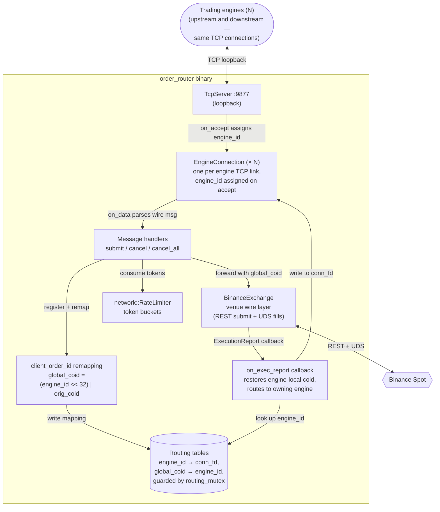

# order_router — Components

Zooms into the `order_router` container from [Level 2 live-trading](../01-containers/live-trading.md). Centralises outbound order flow from N engines onto the single Binance connection, and routes execution reports back to the originating engine.

## Component diagram

## Components

| Component | What it does |
|-----------|--------------|
| **TcpServer** | Loopback TCP server on `:9877`. Accepts connections from trading engines on the same host. |
| **EngineConnection** | One instance per accepted TCP connection. Owns the `conn_fd`, holds the assigned `engine_id`, buffers partial reads, calls `on_engine_message` when a full wire message has been framed. Heap-allocated, TcpServer owns lifetime. |
| **Message handlers** | `handle_submit`, `handle_cancel`, `handle_cancel_all` — parse the wire message (`WireSubmitOrder`, `WireCancelOrder`, `WireCancelAll`) and drive the routing + rate-limit + BinanceExchange calls. |
| **client_order_id remapping** | The correlation trick. Every engine uses its own local `client_order_id` space starting from whatever it wants. On submit, `order_router` builds a globally-unique id: `global_coid = (uint64_t(engine_id) << 32) \| original_coid`. Binance sees `global_coid`; on the way back, extracting the high 32 bits recovers `engine_id`, extracting the low 32 recovers the engine's original coid. No mapping table strictly needed for the coid→engine direction — it's encoded in the id itself. |
| **Routing tables** | Two `std::unordered_map` — `engine_id_to_fd_` and `global_coid_to_engine_`. Guarded by a single `std::mutex`. The comment in the code is honest about this choice: fills are infrequent (~100/s worst case) and never on the tick hot path, so a mutex is the simple safe answer rather than a lock-free structure. |
| **BinanceExchange** | Wraps the actual Binance REST + WebSocket User Data Stream. Submitted orders go through here; execution reports come back through here. `order_router` treats it as a black box that eats orders and produces `oms::ExecutionReport` callbacks. |
| **network::RateLimiter** | Token-bucket rate limiter (from the shared `network/` library, not embedded in this container). Consumed on every submit / cancel / cancel_all. After every consumption, `order_router` sends a rate-limit-status update to the originating engine, so the engine can throttle before it fires more requests. |
| **on_exec_report callback** | Single entry point for everything the venue reports back — acks, fills, rejects, cancels, cancel-rejects. Registered with BinanceExchange at construction. Extracts `engine_id` from the report's `global_coid`, restores the engine-local coid, looks up the connection fd via the routing tables, forwards the report to the right engine. |

## Wire framing and identity

- **Ingress from engines:** loopback TCP. Framing is length-prefixed binary; per-message decode by `EngineConnection::on_data` into `WireSubmitOrder` / `WireCancelOrder` / `WireCancelAll`.
- **Engine identity:** assigned on accept via `next_engine_id_.fetch_add(1)` — engines don't choose their own id. Range is 32 bits, so this container supports ~4 billion engine lifetimes before wrapping, which is not a real concern.
- **coid remapping:** the mechanism that keeps engines completely unaware of each other. Each engine's coid space is its own; no coordination needed. Collisions between engines are impossible by construction.

## Deliberately not here

- Binance API signing, headers, endpoint URLs — that's inside `BinanceExchange`, not this container.
- Rate limit thresholds — read from `RateLimiter` config.
- Cancel-on-ACK race handling — depending on where that lives, it's either inside `BinanceExchange` (wire layer) or inside the engine's `OrderEngine`. Not `order_router`'s concern; it just forwards.

## Not shown at this level

- Class-level structure — read `include/order_router/OrderRouter.h`.
- BinanceExchange internals — has its own concerns (WebSocket lifecycle, signing, retry).

## Next zooms

- [risk_manager components](risk-manager.md) — upstream sibling.
- feed_router / market_feed components — TBD.
- trading_system components — TBD (where the engines that connect to this container live).
- [Level 4 — Flows](../03-flows/) — full order lifecycle across engine → risk_manager → order_router → venue → back to engine.
