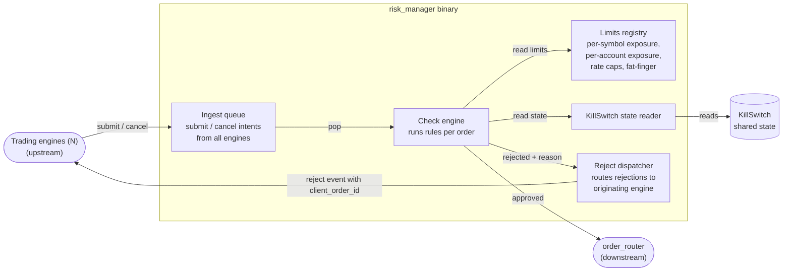

# risk_manager — Components

Zooms into the `risk_manager` container from [Level 2 live-trading](../01-containers/live-trading.md) to show its internals — small surface area, one diagram is enough.

The `risk_manager` sits between the trading engines and the `order_router`. Every submit or cancel from any engine passes through here; the check is cross-engine (limits apply globally, not per-engine).

## Component diagram

## Components

| Component | What it does |
|-----------|--------------|
| **Ingest queue** | MPSC queue receiving submit and cancel intents from all trading engines. Bounded, non-blocking on the engine side. Every order in the system flows through here — there is no bypass path. |
| **Check engine** | Pops from the ingest queue, runs each order against the Limits registry and the KillSwitch state, decides approved or rejected. Deterministic — same order in the same context produces the same decision. |
| **Limits registry** | Cross-engine risk limits — per-symbol exposure caps, per-account exposure caps, rate caps (orders per second), fat-finger price deviation guards, notional size limits. Reloadable at runtime via ParamGateway. |
| **KillSwitch state reader** | Reads the shared KillSwitch flag. If the flag is tripped, every check returns rejected regardless of other rules. Fail-safe: on unknown state, reject. |
| **Reject dispatcher** | Routes rejection events back to the engine that originated the order, tagged with the `client_order_id` so the engine can drop the corresponding tombstone. Approved orders skip this path entirely — they go straight to `order_router`. |

## Key protocol lines

- **Engine → Ingest queue:** IPC (TCP, unix socket, or shm mailbox — deployment detail). Non-blocking on the engine side; if the queue is full, the engine gets a fast-fail rejection rather than blocking on the hot path.
- **Check engine → order_router:** Approved orders forwarded with the original `client_order_id` preserved so the fill routing can find the originating engine later.
- **Check engine → Reject dispatcher → engines:** Rejections carry the `client_order_id` and a rejection reason code (limit exceeded, kill switch tripped, fat-finger, etc.).
- **KillSwitch state reader → KillSwitch:** Read-only. The trip decision lives elsewhere; the reader just observes.

## Deliberately not here

- Specific limit thresholds — that's config, lives in TOML.
- KillSwitch trip decisions and their causes — that's a separate concern; see the KillSwitch component wherever it lives (currently inside `trading_system` per memory, may move out later).

## Not shown at this level

- Class-level structure — read the source.
- Failure modes on the wire between engine and risk_manager — deployment / operations doc.

## Next zooms

- [order_router components](order-router.md) — TBD.
- [feed_router components](feed-router.md) — TBD.
- trading_system components — TBD.
- [Level 4 — Flows](../03-flows/) — a full order lifecycle sequence would show engine → risk_manager → order_router → venue → fill routing back.
