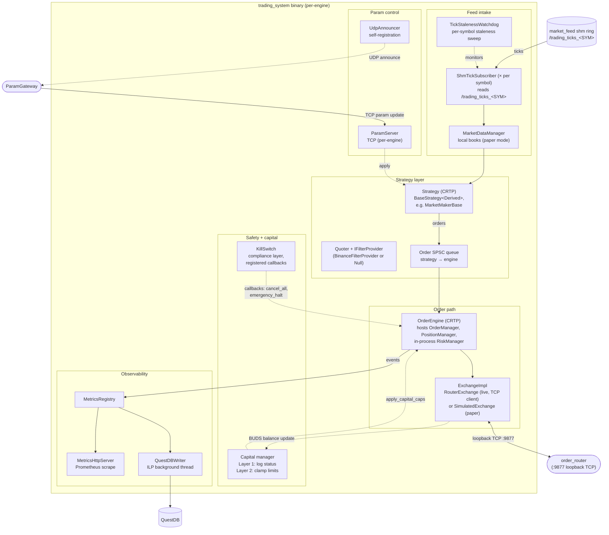
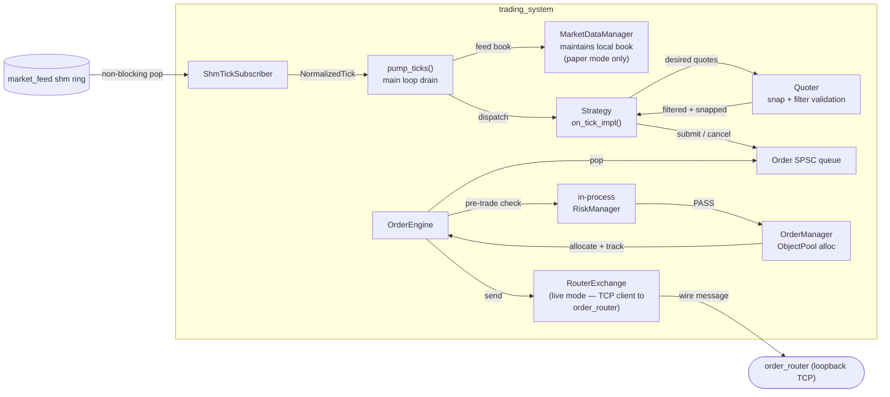

# trading_system — Components

Zooms into the `trading_system` (live_trading) binary from [Level 2 live-trading](../01-containers/live-trading.md). This is the trading engine itself — the process that consumes ticks from `market_feed` shm rings, runs strategy logic, applies pre-trade risk, forwards approved orders to `order_router`, and reconciles the fills that come back.

Three diagrams, same pattern as the other rich Level 3 zooms: structural overview, tick hot path (tick → strategy → order out), and the return path (fill and balance updates coming back → position + risk state).

## Naming disambiguation: `OrderEngine` vs `order_router`

Two components in this system have unfortunately similar names and get confused often. They are **not** the same thing:

- **`OrderEngine`** — a class in `include/oms/OrderEngine.h`, instantiated **inside** every `trading_system` binary. Handles per-engine order lifecycle: pops from the strategy's SPSC queue, runs the in-process `RiskManager` check, allocates via `OrderManager`, calls `ExchangeImpl::submit`, receives `ExecutionReport` callbacks, updates `PositionManager` and forwards `on_fill` to the strategy. One per engine — N engines means N `OrderEngine` instances.
- **`order_router`** — a **separate binary** running once on the host (see [Level 3 order-router](order-router.md)). Holds the single `BinanceExchange`, does cross-engine `client_order_id` remapping, enforces the shared per-account rate limit, routes execution reports back to the originating engine.

The path in live mode is two hops: `Strategy → SPSC → OrderEngine → RouterExchange` (all inside `trading_system`) then TCP to `order_router → BinanceExchange → Binance`. Both components are needed; neither replaces the other.

## 1. Component overview

Structural view. Subsystems collapsed to functional groups; the hot path and return path are unpacked in diagrams 2 and 3.



## 2. Tick hot path (tick → strategy → order out)

One tick's path from the shared-memory ring to an order landing in the outbound queue.



**RiskManager result codes.** In-engine pre-trade check returns one of: `PASS`, `REJECTED_POSITION_LIMIT`, `REJECTED_ORDER_SIZE`, `REJECTED_PRICE_DEVIATION`, `REJECTED_DAILY_LOSS`, `REJECTED_DRAWDOWN_VELOCITY`, `REJECTED_RATE_LIMIT`, `REJECTED_UNFILLED_EXPOSURE`, `REJECTED_SYSTEM_HALTED`. Non-PASS results skip the OrderManager allocation and stay engine-local — the order never leaves the process. Target check budget is <100ns.

## 3. Return path (fills, balance, safety)

What comes back from the venue and how it updates the engine's state.

```mermaid
flowchart TB
    orderrouter(["order_router (loopback TCP)"])

    subgraph binary["trading_system"]
        exchange["RouterExchange<br/>(TCP client to order_router)"]
        oe["OrderEngine"]
        om["OrderManager<br/>tombstone on ack / fill"]
        pm["PositionManager<br/>equity + PnL"]
        strat["Strategy<br/>on_fill / on_order_rejected"]
        risk["RiskManager<br/>update_daily_pnl,<br/>on_order_submitted"]
        capital["Capital manager<br/>apply_capital_caps"]
        metrics["MetricsRegistry"]
        questdb["QuestDBWriter"]

        ks["KillSwitch<br/>trip signal"]
    end

    questdb_ext[("QuestDB")]

    orderrouter -->|ExecutionReport (wire)| exchange
    exchange -->|on_exec_report callback<br/>(TcpConnector I/O thread)| oe

    oe -->|update state| om
    oe -->|forward to strategy| strat
    oe -->|record fill| pm
    oe -->|record for rate limit| risk

    pm -->|equity delta| risk
    pm -->|equity snapshot| metrics

    exchange -.->|BUDS balance update<br/>(forwarded from order_router)| capital
    capital -->|clamp max_position_size,<br/>max_open_order_exposure| oe

    ks -.->|cancel_all_orders / emergency_halt| oe

    metrics --> questdb
    questdb --> questdb_ext
```

**KillSwitch trip.** Compliance layer. Registered callbacks fire on trip:
- `cancel_orders` → `order_engine_.cancel_all_orders()` — cancel every live order at the venue.
- `halt_engine` → `order_engine_.emergency_halt()` — stop accepting new strategy submissions, block on any pending exchange traffic to drain, then hand back to the supervisor to restart cleanly.

Deferred-trip pattern: the trip decision is made on whichever thread noticed the condition, but callbacks run on the main engine thread to avoid re-entering the exchange or the strategy from a non-owning thread.

**Trip conditions.** `KillSwitch::activate(reason, details)` fires for one of nine categorised reasons. Each has a specific source path:

| Reason (enum) | What triggers it | Fired from |
|---------------|-------------------|-----------|
| `MANUAL` | Operator explicit trip via ParamGateway or admin API | Control plane |
| `EXCESSIVE_LOSS` | Daily PnL breach or drawdown-velocity breach | RiskManager / TradingEngineBase |
| `POSITION_BREACH` | Position limit exceeded (should be caught at pre-trade but is a runtime safety net) | RiskManager / TradingEngineBase |
| `ORDER_RATE_EXCEEDED` | Order rate limit exceeded persistently | RiskManager / order queue overflow watchdog |
| `MARKET_DISCONNECT` | Market feed silent past staleness threshold, or User Data Stream stale past `stale_killswitch_s` | `TickStalenessWatchdog`, `BinanceUserDataStream` |
| `RISK_VIOLATION` | General risk-check failure that shouldn't be recoverable | `TradingEngineBase` (order queue push failures crossing threshold) |
| `COMPLIANCE_ALERT` | Post-trade surveillance flagged wash trade, layering/spoofing, or order stuffing pattern | `PostTradeSurveillance` (3 detection paths) |
| `SYSTEM_ERROR` | Uncategorised system-level failure — unexpected exception path | Various |
| `EXTERNAL_SIGNAL` | Trip issued by another container (e.g. `order_router` decides all engines should halt) | Cross-container signalling path |

**Order queue overflow is a specific trip path** worth calling out: the main loop's `check_order_queue_overflow(prev_push_failures)` runs each iteration. When strategy pushes to the order SPSC keep failing (queue full because the engine can't drain), that counter climbs. Past a threshold it activates `KillSwitchReason::RISK_VIOLATION`. This is why a persistently misbehaving strategy takes the whole engine down instead of silently dropping orders.

**Recovery from a trip.**
1. Trip fires → callbacks run on main loop → orders cancelled, engine halted.
2. Engine exits cleanly (or is killed by ProcessManager if halt hangs).
3. `ProcessManager` restarts the engine as a fresh process.
4. On startup, engine replays fills from QuestDB to reconstruct `PositionManager` state (position recovery — see Level 4 flow, TBD).
5. If the trip reason indicated a market or compliance condition that hasn't cleared, the engine trips itself again on the same source and stays dead until an operator explicitly resets via `KillSwitch::reset(auth_token)`.

Reset requires an auth token when `require_auth_for_reset_` is enabled — prevents automated retry loops from bypassing the operator's judgement.

**Capital management.**
- Layer 1 (`log_capital_status`) — periodic account-balance query, log free balances, WARN when USD-denominated risk limits in config exceed `wallet × 0.9`. Pure observability.
- Layer 2 (`apply_capital_caps`) — clamp `max_open_order_exposure` and `max_position_size` to `min(config, stablecoin_usd_free × 0.9)`, push clamped limits into RiskManager. Fires on every BUDS balance update via `on_balance_update_static` trampoline.

## Components

| Component | What it does |
|-----------|--------------|
| **TradingEngine (CRTP)** | Templated on `<ExchangeImpl, Strategy>`. Owns the exchange, order_engine, and strategy. Non-template infrastructure lives in `TradingEngineBase`. |
| **TradingEngineBase** | Non-template base. Owns `MetricsRegistry`, `MetricsHttpServer`, `QuestDBWriter`, local `MarketDataManager`, shm `Subscriber`s, `order_queue_` (SPSC), `ParamServer`, `UdpAnnouncer`, staleness watchdog. Constructed once, template layer above adds strategy-specific pieces. |
| **ShmTickSubscriber (× per symbol)** | Reads `NormalizedTick` events from `market_feed`'s POSIX shm ring for one symbol. Non-blocking pop on the engine side. Independent of other engines subscribing to the same ring. |
| **MarketDataManager (local)** | Local `OrderBookL2<N>` per symbol. Used in paper-trading mode where `SimulatedExchange` needs the book for fill simulation. Not used on the live path. |
| **TickStalenessWatchdog** | Per-symbol staleness detector. WARN on entry to staleness, re-log every ~60s while stale, INFO on recovery. No-op when `tick_staleness_threshold_s == 0`. |
| **Strategy (CRTP)** | `BaseStrategy<Derived>` template. Concrete strategies (`MarketMakerBase`, `SimpleMarketMaker`, …) implement `on_tick_impl`, `on_timer_impl`, `on_fill_impl`, `on_order_rejected_impl`, `dump_params_impl`, `serialize_params_impl`, `set_parameter_impl`. Submits orders into `order_queue_` which the engine drains. |
| **Quoter + IFilterProvider** | Snaps desired quote prices to venue tick sizes and validates against filter constraints (min notional, min qty, max qty). `BinanceFilterProvider` in live mode reads from `exchangeInfo` cache; `NullFilterProvider` in sim/paper is a no-op. |
| **Order SPSC queue** | Single-producer (strategy) single-consumer (engine) ring for order submits and cancels. Constructed once, shared by reference. |
| **OrderEngine (CRTP)** | `OrderEngine<ExchangeImpl, TradingEngine<...>>`. Pops orders from the queue, runs `RiskManager` pre-trade, allocates via `OrderManager`, forwards to `ExchangeImpl`. Owns `PositionManager`, hosts `RiskManager`, calls back into the parent engine for `on_fill` and `on_order_state`. |
| **RiskManager (in-process)** | Pre-trade checks against `RiskLimits`, target <100ns. Tracks per-symbol rate window and 60-sample equity window for drawdown velocity. Emergency halt and daily PnL tracking. Detailed check list is under [risk-manager (deleted)](#) — the class lives in `include/risk/RiskManager.h`. |
| **OrderManager** | `Order` lifecycle tracking with `ObjectPool` allocation (no heap alloc on the critical path). Records tombstone on ack / fill for out-of-order safety. |
| **PositionManager** | Position + PnL + equity tracking. `flatten_position` takes a mark price. |
| **ExchangeImpl** | Template parameter satisfying the `Exchange` base interface. Two concrete choices: `RouterExchange` (live — TCP client to `order_router`, wire messages framed and dispatched, `ExecutionReport`s arrive async on the `TcpConnector` I/O thread) or `SimulatedExchange` (paper / integration tests — in-process fake with a fill simulator). `BinanceExchange` is NOT used inside `trading_system` — it lives only inside `order_router`. This is the whole point of the centralization: engines never talk to Binance directly, they talk to `order_router` via `RouterExchange`. |
| **KillSwitch (compliance)** | All-static class with atomic `killed_` flag and mutex-protected callback registry. Deferred-trip pattern — decision on any thread, callbacks on the engine main thread. Callbacks registered by the engine on init: `cancel_orders`, `halt_engine`. |
| **Capital manager** | Not a distinct class — two methods on `TradingEngine`: `log_capital_status()` (Layer 1, observability) and `apply_capital_caps()` (Layer 2, clamps risk limits). Called on every BUDS balance update via the trampoline. |
| **ParamServer** | TCP server for runtime parameter updates. `ParamAdapter` wraps `strategy_` for the incoming param handlers. |
| **UdpAnnouncer** | Announces engine presence on start so the central `ParamGateway` can discover and hold a live map. |
| **MetricsRegistry** | Per-engine metric counters (ticks_received, fills, PnL, rejections by cause, etc.). |
| **MetricsHttpServer** | Prometheus-compatible scrape endpoint. Serves the current `MetricsRegistry` snapshot. |
| **QuestDBWriter** | Non-blocking SPSC from the hot path to a background TCP writer thread. Writes ILP to QuestDB. |

## Key data flows

- **Hot path (steady state):**
  `shm ring → ShmTickSubscriber → pump_ticks → MarketDataManager (paper only) + Strategy::on_tick → Quoter → Order SPSC → OrderEngine → RiskManager pre-check → OrderManager alloc + RouterExchange::submit → loopback TCP → order_router → BinanceExchange → Binance`.
- **Return path:**
  `Binance → BinanceExchange (in order_router) → order_router routing → loopback TCP → RouterExchange (in this engine) → on_exec_report callback → OrderEngine → (OrderManager tombstone / PositionManager update / Strategy::on_fill / RiskManager::on_order_submitted counter)`.
- **Capital cap loop:**
  `Binance BUDS → BinanceExchange (in order_router) balance cache → forwarded to engines → RouterExchange balance-update callback → on_balance_update_static → apply_capital_caps → OrderEngine::set_risk_limits → RiskManager limits clamped`.
- **KillSwitch trip:**
  `Trip signal from any thread → deferred queue → main-loop tick → registered callbacks: OrderEngine::cancel_all_orders + OrderEngine::emergency_halt`.

## Backpressure and overflow behavior

The trading engine sits between multiple bounded queues on both the tick-in and order-out paths. Overarching invariant: nothing on the tick hot path blocks — if the strategy can't keep up or the order path can't drain, we surface a health signal and let ProcessManager decide.

| Queue / buffer | Bound | Behavior on full | Rationale |
|----------------|-------|-------------------|-----------|
| **ShmTickSubscriber** (reads from `market_feed` shm ring) | 65536 slots (publisher's ring) | Publisher overwrites on wrap — subscriber detects lag via sequence number gap. On gap, engine drops the missed range and continues from the current head, then MDM sets a recovery-mask bit and triggers a REST re-sync. | Market data staleness is bounded by ring depth; slow subscriber is the subscriber's problem, not the publisher's. |
| **Order SPSC queue** (strategy → engine) | Bounded ring (`core::ORDER_QUEUE_SIZE`) | Strategy's submit fast-fails with `push_failures` counter incremented. `check_order_queue_overflow` runs periodically — if failures accumulate past threshold, KillSwitch trips. | Strategy is single-threaded on tick loop; a full queue means the engine main loop is stalled or falling behind. Escalation to KillSwitch is the correct response — better to halt than to have stale intents in flight. |
| **QuestDBWriter SPSC hot path → background writer** | Bounded ring | Hot-path producer drops the metric event and increments a drop counter. Background writer keeps draining independently. | Metrics are for observability, not correctness — dropping is fine, blocking on ILP would break the tick budget. |
| **ParamServer TCP recv buffer** | Standard TCP | Kernel flow control back-pressures the operator side; not on the hot path. | Param changes are infrequent, blocking the operator side is fine. |
| **RouterExchange outbound (TCP to order_router)** | Kernel + application send buffer | If order_router is slow to accept, `RouterExchange::submit` fails fast; `OrderEngine` treats it as a rejection and forwards `on_order_rejected` to the strategy. | Better to reject and let the strategy re-quote next tick than to queue stale orders. |

**Order-queue overflow → KillSwitch.** The `check_order_queue_overflow(prev_push_failures)` method runs each main-loop iteration. If push failures are climbing, that means the engine can't drain the strategy's intents — a symptom that either the strategy is misbehaving (spamming orders) or the exchange path is stuck. In either case, the safe response is `KillSwitch::trip` → `cancel_all_orders` + `emergency_halt`. ProcessManager restarts the engine, and position recovery reconciles state from QuestDB.

## Deliberately not here

- Binance API signing, HTTP details, WebSocket lifecycle — lives inside `BinanceExchange`.
- Strategy-specific quoting logic (MarketMakerBase's `update_quotes`, spread rules, inventory management) — belongs in a strategy-focused doc.
- MDM internals (per-symbol book format, sequence validation) — see the marketdata-focused doc.
- Object pool internals, SPSC queue implementation — see `include/core/*`.

## Not shown at this level

- Class-level structure — read the source (`include/engine/TradingEngine.h`, `TradingEngineBase.h`, `include/oms/*`, `include/risk/RiskManager.h`, `include/strategy/*`).
- Cross-container flows (full order lifecycle spanning engine → order_router → venue → back → engine) — see [Level 4 flows](../03-flows/).
- Deployment topology, one-engine-per-symbol vs one-engine-per-strategy — see the operations doc.

## Sibling zooms

- [order_router components](order-router.md) — where orders go when they leave this container.
- [market_feed components](market-feed.md) — where the ticks come from before the shm ring.
- [feed_archiver components](feed-archiver.md) — the sibling collection binary that writes to disk.
- [backtest_app components](backtest.md) — the offline-replay counterpart to this online engine.
- [Level 4 — Flows](../03-flows/) — cross-cutting sequences.
