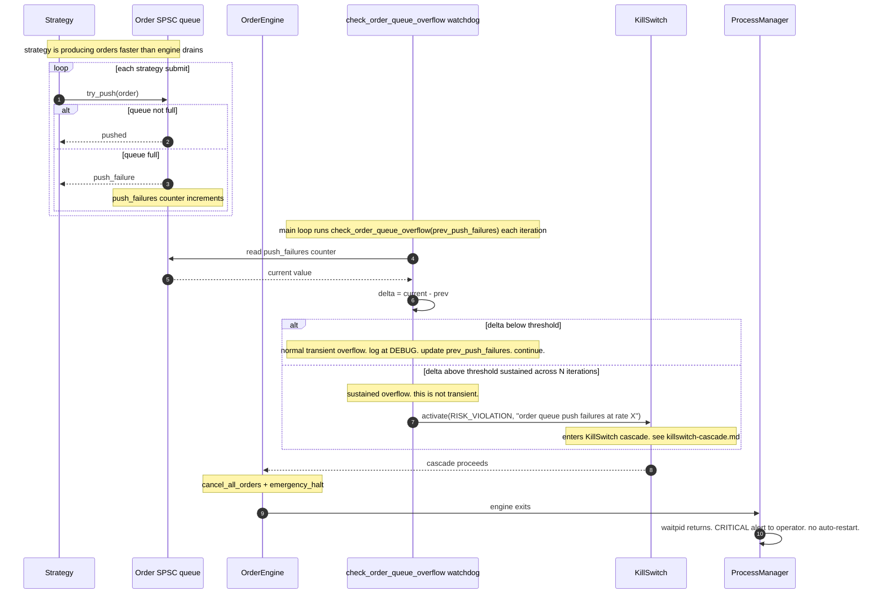

# Backpressure escalation

**Level 4 flow.** Documents how bounded-queue backpressure inside the trading engine escalates from "some drops" through "sustained overflow" to a KillSwitch trip and full engine restart. Ties the per-queue behavior documented in each Level 3 file into a single behavioral flow from the safety-critical angle.

Referenced from `trading-engine.md` (backpressure and KillSwitch sections) and from [KillSwitch cascade](killswitch-cascade.md); documented here as the temporal sequence.

## Why this matters

The trading engine has multiple bounded queues on the tick-in and order-out paths (SPSC between strategy and engine, shm ring from market_feed, QuestDB writer). Each has a fast-fail-or-drop policy documented at Level 3. But sustained backpressure means something is deeply wrong — the strategy is spamming orders, the venue path is stuck, or the tick loop can't keep up. Silently dropping forever hides the problem while it accumulates cost. The escalation path exists to convert sustained drops into a loud, halting signal.

## Sequence

## What sustained means

The watchdog doesn't trip on a single burst. Real markets produce bursts (news events, opening auction relaxation, symbol-specific events) that fill the queue briefly. The threshold is calibrated so that:

- A short burst that resolves within a few main-loop iterations is logged and forgotten.
- A rate of push failures maintained across many iterations means the drain is systematically behind the fill — indicative of a stuck OrderEngine (e.g. RouterExchange TCP send blocking, order_router unresponsive), or a runaway strategy submitting far more orders than the engine can dispatch.

Neither of those is safe to continue. The trip is the correct response.

## Coordination with related backpressure paths

Not every backpressure scenario in the trading engine escalates through this same watchdog. Different queues have different escalation partners:

| Queue | Primary handling | Escalation partner |
|-------|------------------|--------------------|
| **Order SPSC (strategy → engine)** | fast-fail with push_failures counter | this watchdog → `RISK_VIOLATION` trip |
| **ShmTickSubscriber (market_feed → engine)** | ring wrap-around, engine detects via seq gap | `TickStalenessWatchdog` → `MARKET_DISCONNECT` trip |
| **QuestDBWriter SPSC (hot path → background)** | drop with counter | metrics-visible only; does NOT trip. Metric drops are considered acceptable observability loss. |
| **RouterExchange outbound TCP send** | fast-fail treated as `on_order_rejected` | strategy handles per-order, no aggregate escalation. |

Each queue that CAN trip has its own dedicated watchdog reading its counters. This diagram covers the order-SPSC path because that's the one with a canonical `check_order_queue_overflow` mechanism named in the source.

## The specific RISK_VIOLATION reason

The KillSwitch reason for backpressure escalation is `RISK_VIOLATION` rather than a dedicated backpressure enum value. The rationale from the codebase: sustained failure to dispatch approved orders IS a risk condition, because:

- Approved orders are held in engine memory but not sent to the venue — the strategy thinks quotes are live but the venue doesn't have them.
- Position exposure vs. intended exposure diverges silently.
- The longer this continues, the more the engine's internal state and the venue's state disagree.

Same category as any other divergence between intended and actual state, so it goes under the same enum. If backpressure patterns became specifically-worth-differentiating in the future, adding a new enum value would be straightforward.

## Related

- [KillSwitch cascade](killswitch-cascade.md) — what happens after `activate(RISK_VIOLATION)` is called; this flow is entry into that cascade.
- [Position recovery](position-recovery.md) — what runs on the fresh process after the cascade completes.
- [trading-engine components](../02-components/trading-engine.md) — backpressure section that names each queue and its per-queue policy.
- [order-lifecycle](order-lifecycle.md) — the successful path this flow's failure mode diverges from.
