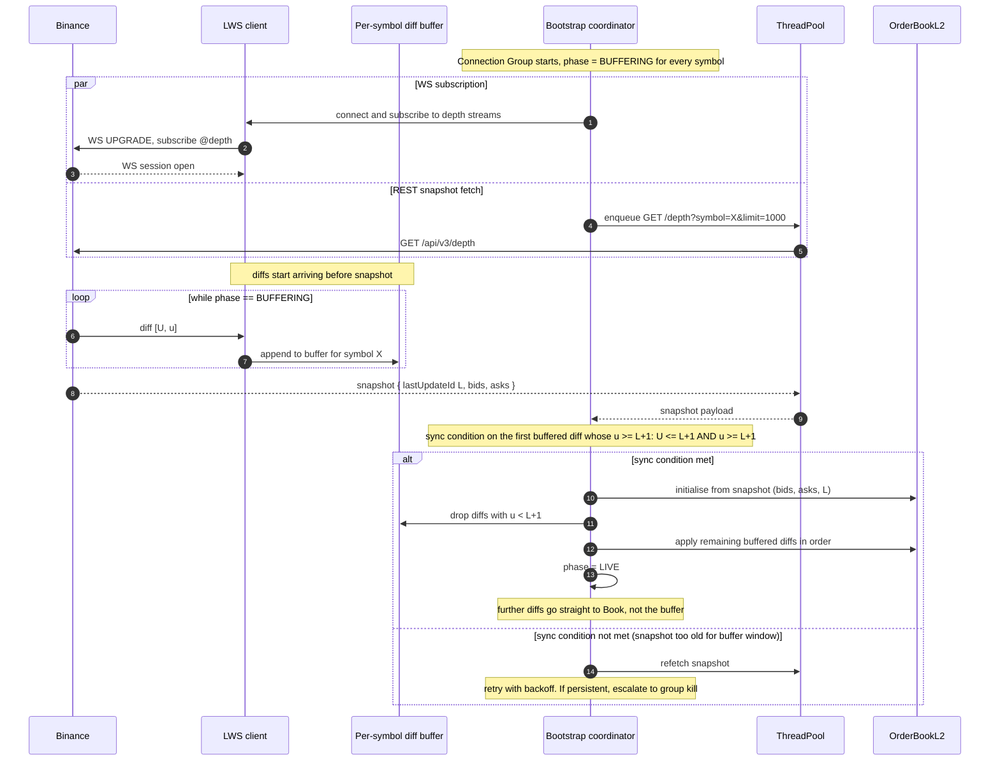

# Bootstrap protocol

**Level 4 flow.** How a Connection Group transitions from `BUFFERING` to `LIVE` on startup, ensuring the local order book is a correct projection of the venue before any tick reaches downstream consumers. Applies to both `feed_archiver` and `market_feed` — the mechanism is identical, only the downstream consumers differ.

Referenced from [feed-archiver.md](../02-components/feed-archiver.md) and [market-feed.md](../02-components/market-feed.md); documented here as the full temporal sequence.

## The problem being solved

Binance's depth stream is a *diff* stream — each WS message says "the book at update_id U..u changed as follows." To apply diffs correctly, you first need a starting book (the snapshot). But the snapshot arrives via a separate REST call that races the WS stream. Diffs arriving before the snapshot land, or diffs whose `U` predates the snapshot's `lastUpdateId`, cannot be applied.

The protocol below resolves that race with a bounded buffer, a specific sync condition, and a phase transition.

## Sequence

## The sync condition explained

Binance's guarantee for the depth stream: within one WS diff message, `U` is the first update ID and `u` is the last update ID. Adjacent messages have `U(next) = u(prev) + 1`. The snapshot has a `lastUpdateId` L; the correct meaning is *all state up to and including update L is reflected in this snapshot*.

For a diff `[U, u]` to be compatible with snapshot L, two conditions must hold:

- **`u >= L + 1`** — the diff extends the book past what the snapshot already covered. Otherwise the diff is entirely subsumed by the snapshot; drop it.
- **`U <= L + 1`** — the diff starts at or before the update immediately after the snapshot. Otherwise there's a hole between the snapshot and this diff — data was missed.

The first diff we can apply post-snapshot is the earliest buffered one satisfying both. All buffered diffs with `u < L + 1` are dropped (already in snapshot); all with `U > L + 1` fail the sync condition and mean the buffer is stale relative to the snapshot — refetch.

## Buffer sizing and stale-snapshot escalation

The per-symbol diff buffer is bounded — configurable, typically a few hundred entries. If it fills before the snapshot arrives (either the REST fetch is slow or the diff stream is unusually chatty), the oldest diffs get discarded, which risks making the sync condition unsatisfiable on arrival.

If the sync condition can't be met on snapshot arrival:
- **First failure:** refetch the snapshot. Binance is fast; a fresh snapshot will typically satisfy the condition against the newer buffer contents.
- **Persistent failure:** escalate to group kill. `BinanceFeedManager` disconnects the LWS client for this group, logs the event via `event_hook`. Other groups keep running (isolation).

Persistent bootstrap failure usually indicates a network issue or an overloaded Binance endpoint. Kill-then-retry is the correct response — retrying inside the same group would risk indefinite BUFFERING, which upstream consumers would see as ticks not advancing.

## Mid-flight recovery (the same protocol, different trigger)

The bootstrap protocol is used in two situations. On group start, every symbol begins in `BUFFERING`. Mid-flight, when the sequence gap detector on the depth path catches a `U` discontinuity (see [WS gap recovery flow](ws-gap-recovery.md)), the affected symbol is re-entered into `BUFFERING`, its diffs buffered, and the exact same protocol above runs to bring it back to `LIVE`. The buffer is per-symbol, so one symbol's recovery doesn't stall others in the same group.

## What differs between feed_archiver and market_feed

The bootstrap mechanism is identical. The only difference is what the downstream consumer of the LIVE tick does:

| Container | Consumer of LIVE ticks | Failure impact |
|-----------|-----------------------|----------------|
| **feed_archiver** | `SymbolRecorder` writes to `Local Tick Archive` binary files | Missed ticks are permanently gone from the archive; a gap in the historical record shows up in backtests |
| **market_feed** | `ShmTickPublisher` publishes to per-symbol POSIX shm ring | Downstream trading engines see ticks stop advancing; `TickStalenessWatchdog` starts a warning timer; eventually `MARKET_DISCONNECT` trip if the group can't recover |

Both cases prefer a group kill and clean re-bootstrap over publishing partial or inconsistent state downstream.

## Related

- [feed-archiver components](../02-components/feed-archiver.md) — the diagrams and component table for the bootstrap coordinator and buffer.
- [market-feed components](../02-components/market-feed.md) — same mechanism, different downstream consumer.
- [tick-flow](tick-flow.md) — what happens after bootstrap completes.
- [WS gap recovery](ws-gap-recovery.md) — same protocol invoked mid-flight instead of at startup.
