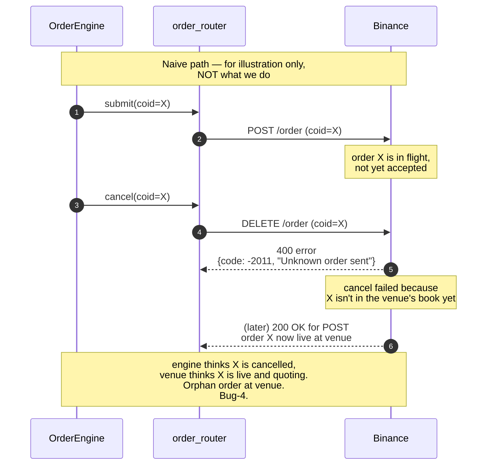
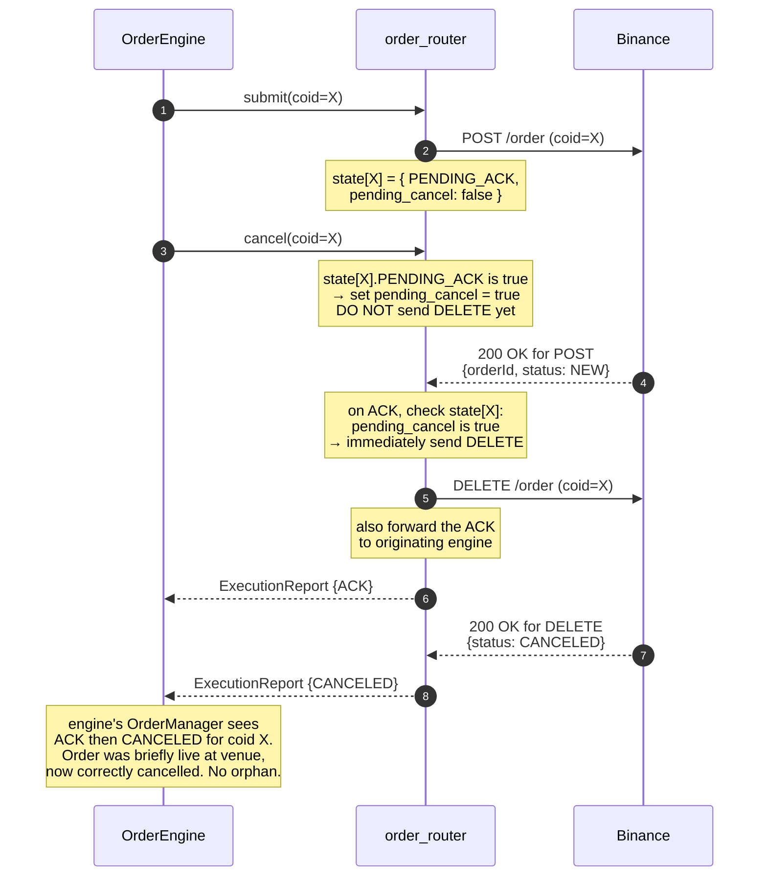

# Cancel-on-ACK race handling

**Level 4 flow.** Specific handling for the case where an engine issues a cancel for an order that is still in flight to the venue and hasn't been acknowledged. Naive implementations fail because the cancel and the order arrive at the venue out of order. The wire-layer fix (in `BinanceExchange` inside `order_router`) holds the cancel until the ACK arrives, then flushes both in the same tick.

Referenced from [order-lifecycle.md](order-lifecycle.md) as one of the branch cases; documented in detail here.

## The race (what the naive implementation gets wrong)

The orphan is the failure mode. Engine's `OrderManager` marked coid X as cancelled and moved on. Venue has coid X live at some price and will happily fill it. Positions and risk are wrong until the next full reconciliation.

## The fix (Cancel-on-ACK at wire layer)

`BinanceExchange` — the wire-layer component inside `order_router` — tracks a per-coid pending-cancel flag. When a cancel arrives for a coid that hasn't been ACK'd yet, the cancel is held (not sent). When the ACK arrives, the held cancel is flushed to the venue in the same tick.

## State machine inside BinanceExchange

Per coid the wire layer holds:

| State | Meaning | Cancel behavior |
|-------|---------|-----------------|
| **PENDING_ACK** | Order was sent, awaiting venue ACK | Set `pending_cancel = true`; do not send DELETE yet |
| **ACKED** | Venue has confirmed order is live | Send DELETE immediately |
| **DONE** | Order has terminated (filled, cancelled, rejected) | Cancel is a no-op; log warning about late cancel |

On ACK arrival:
- If `pending_cancel` is set, send DELETE for this coid immediately (same tick).
- Otherwise, just transition PENDING_ACK → ACKED and forward the ACK to the engine.

On FILL arrival while `pending_cancel` is set:
- The cancel raced the fill and lost.
- Forward the FILL to the engine normally.
- Clear `pending_cancel` — nothing to cancel now (order is done).
- Engine's `OrderManager` handles the fill; strategy's `on_fill_impl` fires.

## Why the wire layer and not the engine

An earlier attempted fix put the pending-cancel flag inside the engine's `OrderManager` — track it there, decide whether to send. That has three problems:

1. **Latency:** engine has to hold the cancel, wait for ACK routing back through order_router → RouterExchange → OrderManager, THEN issue the cancel. Round-trip added.
2. **Order in the queue:** if the engine holds the cancel and the ACK triggers a cancel-send, the send goes through the order SPSC queue and OrderEngine's dispatch again — same code path as any other cancel. Race lives on inside the engine.
3. **Multi-engine correctness:** if two engines happen to have submitted coid collisions (they can't, because of the coid remapping — but as a defensive property), the wire layer is the only place that has the venue-authoritative view.

Putting it at the wire layer (`BinanceExchange` inside `order_router`) means:
- No queue round-trip; the cancel flushes in the same wire-layer tick as the ACK.
- Engine sees ACK and CANCELED in immediate succession — no latency-sensitive coordination needed.
- The wire layer is the single point that talks to the venue; it's the natural authority.

## Edge cases

**Cancel arrives after DONE.** Order was already filled or cancelled by another path. Cancel is logged as late, no venue call, no ExecutionReport forwarded to engine (nothing to report).

**Multiple cancels for the same coid.** Only the first sets `pending_cancel`; subsequent cancels are idempotent while the state is PENDING_ACK. Once transitioned to DONE, all cancels are late no-ops.

**Cancel arrives before any submit.** Coid is unknown to `BinanceExchange`. Reject the cancel back to the engine as `ExecutionReport {REJECTED, "unknown coid"}`. Engine's OrderManager handles.

**Engine dies while cancel is pending.** State inside `BinanceExchange` is process-local. When order_router loses the engine's TCP connection, the engine_id is marked dead; the pending-cancel flag is honored on ACK arrival (still send DELETE), but the resulting ExecutionReport has nowhere to go. On engine restart, [position recovery](position-recovery.md) reconciles via `GET /openOrders` and `GET /myTrades` — orphan risk is bounded to whatever the recovery timing allows.

## What this flow does not cover

- What happens on the strategy side after seeing ACK immediately followed by CANCELED — that's strategy logic, not architecture.
- Cancel/replace (amend) — a separate primitive not currently used; would need its own race handling.

## Related

- [order-lifecycle](order-lifecycle.md) — the flow that includes cancel-on-ack as a branch case.
- [order-router components](../02-components/order-router.md) — where BinanceExchange (the wire layer) lives.
- [trading-engine components](../02-components/trading-engine.md) — where OrderEngine and OrderManager live.
- [position-recovery](position-recovery.md) — the safety net that catches orphans if this flow somehow fails.
