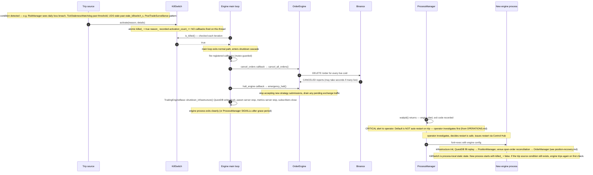

# KillSwitch trip cascade

**Level 4 flow.** The full sequence from a trip condition being detected somewhere in the system to the trading engine returning to normal operation (or refusing to). Ties together several already-documented flows — position recovery, order lifecycle, backpressure escalation — because KillSwitch is the coordination point for every safety-critical event in the system.

Referenced from [trading-engine.md](../02-components/trading-engine.md#killswitch-trip) (trip conditions table) and [position-recovery.md](position-recovery.md) (recovery is what happens after the cascade completes).

## Sequence

## What each stage does and why

### Stage 1: detection (steps 1-2)

Any thread can call `KillSwitch::activate(reason, details)`. The set of trip sources is enumerated in `KillSwitchReason` — nine values, each fired from a specific component (see [trip conditions table in trading-engine.md](../02-components/trading-engine.md)). Detection is decentralised on purpose — every subsystem that can meaningfully identify a safety-critical condition is empowered to trip, without going through a coordinator.

`activate` sets an atomic `killed_ = true`, records the reason, and returns immediately. **It does not fire callbacks on the source thread.** This is the deferred-trip pattern — critical because the detecting thread may be:
- The BinanceExchange callback thread (holds locks we don't want to re-enter)
- The LWS thread (must never block)
- The RiskManager on the strategy submit path (deep in a call chain)

Firing cancel_all + halt from any of these would risk re-entering the exchange or the strategy from a thread that doesn't own that state.

### Stage 2: propagation (steps 3-4)

Every iteration of the engine's main loop starts with `while (running_ && !KillSwitch::is_killed())`. The atomic read is cheap. When it flips to true, the loop drops out of the normal tick-drain path and enters shutdown.

Typical detection-to-shutdown delay: one main-loop cycle. That's tens of microseconds to a millisecond depending on tick load. The engine will not accept any new strategy submissions during this window (queue continues to drain but the loop no longer runs the tick pump).

### Stage 3: callbacks (steps 5-7)

The main loop iterates the registered callback list (mutex-guarded, but there are only a handful of callbacks and callback iteration is not on a hot path). Two callbacks are registered by TradingEngine on init:

- `cancel_orders` → `OrderEngine::cancel_all_orders()`. Iterates every entry in the OrderManager and sends a cancel intent for each live coid. These flow through the normal path — `RouterExchange::cancel → order_router → BinanceExchange → DELETE /order`. May take seconds if many orders are live.
- `halt_engine` → `OrderEngine::emergency_halt()`. Sets an internal flag that rejects any further strategy submissions. Waits for in-flight exchange traffic to drain (bounded by a timeout).

The order matters: cancel_orders first, halt_engine second. Callbacks are registered in that order. Cancelling before halting ensures live orders don't miss their cancel due to a halted OrderEngine.

### Stage 4: shutdown (steps 8-9)

`TradingEngineBase::shutdown_infrastructure()` flushes the QuestDBWriter (so fill history is durable before exit), stops the param server, stops the metrics HTTP server, closes shm subscribers. Engine process then exits with a specific exit code indicating trip vs normal shutdown.

### Stage 5: supervision (steps 10-11)

`ProcessManager` sees `waitpid()` return a non-zero exit status. Per OPERATIONS.md:

> **DO NOT auto-restart** on crash. Reason: something is broken; restarting blindly wastes money.

Instead, the operator is alerted (Control Hub notification, CRITICAL level). The operator reviews logs, verifies the trip reason, checks that the underlying condition has cleared, and only then issues a restart.

Config-change restarts are handled differently — those go through the SIGTERM-with-grace-period path, not this cascade.

### Stage 6: recovery (steps 12-14)

Fresh engine process starts and runs the [position-recovery flow](position-recovery.md). This reconstructs PositionManager from QuestDB fill history and OrderManager from venue open orders.

**Critical property:** `KillSwitch` is process-local static state. The new process starts with `killed_ = false`. If the trip source condition still exists (e.g. market feed is still disconnected because Binance is down), the engine trips itself again on first check. This is intentional — the KillSwitch acts as a distributed circuit breaker with no cross-process memory. Persistent problems will keep tripping restarts until an operator explicitly gates the restart with `KillSwitch::reset(auth_token)` after verifying the source condition has cleared.

## Coordination with other flows

- **[Backpressure escalation](README.md#planned)** — order queue push failures → `check_order_queue_overflow` → `KillSwitch::activate(RISK_VIOLATION)`. Enters this cascade at step 1.
- **[Order lifecycle](order-lifecycle.md)** — during the cancel_orders callback, every live order goes through a cancel-lifecycle. Same code path as any operator-issued cancel; the source is different (KillSwitch instead of Strategy).
- **[Position recovery](position-recovery.md)** — the recovery-after-restart flow starts at step 12 of this cascade. Trip cascade is what puts the engine in the state that position recovery brings it out of.
- **UDS stale trip** — `BinanceUserDataStream` fires `activate(MARKET_DISCONNECT)`. This is the `EXTERNAL_SIGNAL` shape from the engine's point of view (source is outside the engine process); the cascade is the same shape once activate is called.

## Failure modes within the cascade

| Failure | Behavior |
|---------|----------|
| Cancel callback fails to send DELETE to Binance | Log the failure. Order remains live. Position recovery on restart picks it up via GET /openOrders. |
| Halt callback times out waiting for in-flight drain | Timeout is bounded (~5 seconds). After timeout, proceed to shutdown regardless. Any in-flight state is lost; position recovery reconciles. |
| Engine process hangs during shutdown | ProcessManager sends SIGKILL after grace period. State loss bounded by whatever QuestDBWriter had drained before exit. |
| ProcessManager itself is down | Engine exits but nothing restarts. Operator notices via missing metrics in Grafana or absence of engine in Control Hub inventory. |
| KillSwitch::reset is called while source condition still active | Engine trips again on first check after reset. Reset is idempotent, does not create infinite loops (each trip is a fresh activation). |

## What resets a trip

The trip persists across:
- **Callbacks executing** — killed_ stays true until reset.
- **Engine shutdown** — process-local state; new process starts clean but will re-trip if condition persists.
- **Time** — no automatic timeout. Only explicit reset clears it.

Reset requires:
- **`KillSwitch::reset()`** — no auth, only usable when `require_auth_for_reset_ = false` (dev / test).
- **`KillSwitch::reset(auth_token)`** — production; auth token validated by injected `TokenValidator`. Prevents automation from bypassing the operator's judgement on whether the source condition has actually cleared.

## Related

- [trading-engine components](../02-components/trading-engine.md) — KillSwitch trip conditions table, callback registration.
- [order-lifecycle](order-lifecycle.md) — the cancel path used by the cancel_orders callback.
- [position-recovery](position-recovery.md) — what happens after the cascade at step 12.
- [order-router components](../02-components/order-router.md) — where the UDS stale check that trips MARKET_DISCONNECT lives.
