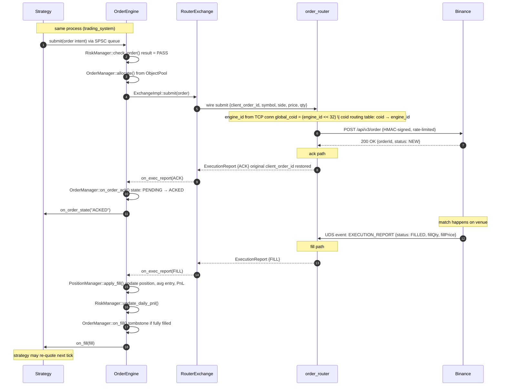

# Order lifecycle

**Level 4 flow.** The full path an order takes from the strategy deciding to trade through venue acknowledgement to fill and position update. Touches every container in the live-trading data plane: `trading_system` (Strategy, OrderEngine, RiskManager, OrderManager, PositionManager, RouterExchange), `order_router` (BinanceExchange), and the external Binance venue.

This is the flagship flow — a stranger reading the docs should be able to follow one order from intent to accounted-for through every layer in the system.

## Happy path

## Branches from the happy path

### Pre-trade risk reject

Between steps 2 and 3, `RiskManager::check_order()` can return non-PASS (one of `REJECTED_POSITION_LIMIT`, `REJECTED_ORDER_SIZE`, `REJECTED_PRICE_DEVIATION`, `REJECTED_DAILY_LOSS`, `REJECTED_DRAWDOWN_VELOCITY`, `REJECTED_RATE_LIMIT`, `REJECTED_UNFILLED_EXPOSURE`, `REJECTED_SYSTEM_HALTED`). In that case:

- The order never leaves the engine.
- `OrderManager::allocate()` is skipped — no ObjectPool slot consumed.
- The engine calls `Strategy::on_order_rejected_impl(client_order_id, reason)`. Strategy typically clears its own last-order pointer (see `MarketMakerBase::on_order_rejected_impl` clearing `last_bid_order_` / `last_ask_order_` — closes the dangling-pointer race after the fat-finger check kills a stale quote).

The order was never on the wire, so no venue interaction is needed.

### Venue reject

Steps 7-9 can produce a rejection instead of ACK — for example, order fails `MIN_NOTIONAL`, exceeds `MAX_QTY`, or violates a symbol filter. Binance returns HTTP 400 (or an error code in the response body). `BinanceExchange` translates to `ExecutionReport {REJECTED, reason_code}` and forwards through order_router the same way as an ACK. Engine-side, `OrderManager` tombstones the entry, `Strategy::on_order_rejected_impl` fires.

The pre-trade filter check in `Quoter + BinanceFilterProvider` is supposed to catch these before they hit the wire, but the venue-side check is the authoritative one and does occasionally reject something the local filter thought was fine (e.g. exchangeInfo cache lag).

### Cancel-on-ACK race

If the strategy issues a cancel between step 5 (order sent) and step 10 (ACK received), the cancel arrives at `order_router` before it knows the venue's `orderId`. `order_router` holds the cancel as a pending flag against the `client_order_id`; when ACK arrives, both the ACK and the cancel are flushed in the same tick. See the dedicated [Cancel-on-ACK flow](cancel-on-ack.md) (TBD) for the sequence.

### Partial fills

The FILL path can produce multiple UDS events — one per partial. Each carries the same `client_order_id`, an incremented `executionId`, and `cumQty` / `leavesQty` to indicate how much is done vs remaining. `OrderManager` keeps the entry live (no tombstone) until `leavesQty == 0`. `PositionManager` accumulates position per fill, computes weighted average entry. `Strategy::on_fill` fires per partial, so the strategy can react (e.g. cancel the remaining leaves if the fill signals adverse selection).

### Late fills after reconnect

If UDS was disconnected when the fill happened, the event isn't in the WS stream. `order_router` reconciles via `GET /api/v3/myTrades` after UDS reconnect and forwards missed fills to the originating engine with a `LATE_FILL` flag. Engine treats them as normal fills but doesn't double-count against any partial state that made it through before disconnect. Details in [order-router reconnect section](../02-components/order-router.md).

## Timing budget

Rough budgets on the hot path per hop, at retail-broker latency:

| Segment | Budget |
|---------|--------|
| Strategy `on_tick` → `submit()` | tens of µs |
| SPSC push + pop | sub-µs |
| RiskManager check | <100 ns (target) |
| OrderManager allocate | sub-µs (ObjectPool) |
| RouterExchange framing + TCP send | ~µs |
| order_router receive + BinanceExchange::submit + HTTPS | 1-10 ms (dominated by internet RTT to Binance) |
| Binance match | milliseconds to seconds depending on side of book |
| UDS deliver back | tens of ms |
| Engine-side callback → position update | sub-µs |

Nothing on the local hot path (steps 1-6, 12-16 in the diagram) blocks. Binance round-trip dominates end-to-end latency; local processing is a rounding error against it.

## Related

- [trading-engine components](../02-components/trading-engine.md) — where OrderEngine, RiskManager, OrderManager, PositionManager live.
- [order-router components](../02-components/order-router.md) — where the client_order_id remapping and BinanceExchange live.
- [position-recovery flow](position-recovery.md) — how PositionManager is reconstructed after restart; complements this flow (this one shows how state gets built up in normal operation, position-recovery shows how it gets rebuilt after loss).
- KillSwitch trip cascade (TBD).
