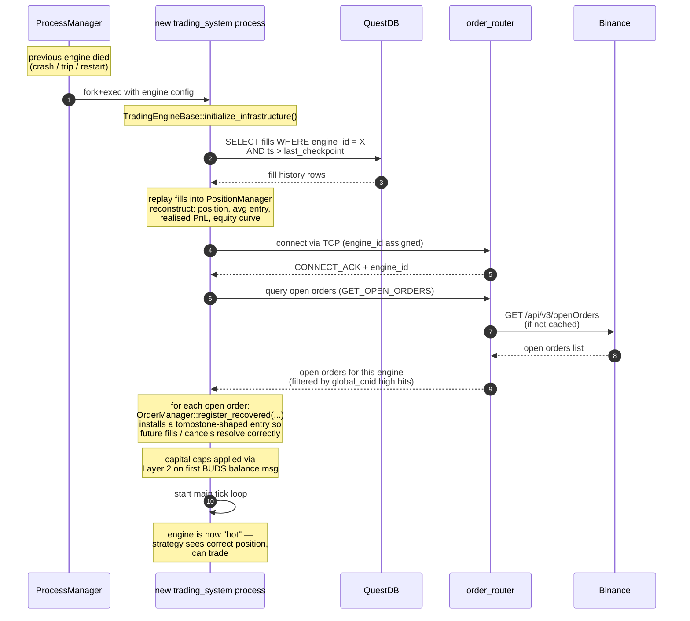

# Position recovery after restart

**Level 4 flow.** Spans `trading_system` (the engine restarting), `ProcessManager` (the supervisor), `QuestDB` (fill history), and `order_router` / `BinanceExchange` (venue reconciliation).

Whenever a trading engine restarts — crash, KillSwitch trip, config change, deploy, or manual restart — its in-memory `PositionManager` and `OrderManager` state is lost. Both must be reconstructed before the engine resumes trading. The system trusts two sources: **QuestDB's fill history** for what has already filled, and **the venue's open-order state** for what's still live on the wire. Local state is derived, never authoritative.

## Sequence

## Why QuestDB is the source of truth for fills

`QuestDBWriter` writes every fill on the hot path via non-blocking SPSC, and a background thread persists to QuestDB. This means:

- Every fill the engine ever saw is durably recorded before the engine goes down (subject to the background thread having drained — bounded by seconds worst case).
- Recovery reads the same records back. There is no separate "position snapshot" file; the fill journal IS the state, and PositionManager is a projection.
- If QuestDB itself is unavailable at recovery time, the engine cannot verify its position and refuses to start trading — it exits and lets ProcessManager retry.

## Why the venue is the source of truth for open orders

Local `OrderManager` state is lost on restart. But orders that were live on Binance when the engine died are still live on Binance — the venue doesn't know or care that our process crashed. Recovery must:

1. **Not** re-submit those orders (double-submit).
2. **Not** ignore them either — fills against them will arrive after recovery, and OrderManager needs to know they exist so the fills can be resolved.

The reconciliation step (step 6-8 in the sequence) fetches the venue's open-order list and installs a `register_recovered(client_order_id, symbol, side, remaining_qty)` entry in OrderManager. These entries are tombstone-shaped — they can't be re-submitted, they only accept ack/fill/cancel updates. Once resolved (fully filled or cancelled) they retire normally.

## Guarantees and non-guarantees

**What recovery guarantees:**
- Position and realised PnL are exactly reconstructed from the fill journal.
- Open orders at the venue are known to OrderManager and their eventual fills will be handled correctly.
- No double-submit of orders that were live before the crash.

**What recovery does NOT guarantee:**
- **Fills that happened during the outage window are eventually observed, not immediately.** During the gap between last QuestDB write and the recovery query, fills can happen at the venue. Those are reconstructed via `GET /myTrades` in the order_router UDS-reconciliation path (see `order-router.md`) and forwarded to the engine as `LATE_FILL`s after recovery completes.
- **Strategy internal state is not restored.** The strategy sees a warm PositionManager but starts fresh on its own memory (quote history, timers, adaptive parameters). This is deliberate — strategy state is treated as reproducible from ticks, not durable.
- **In-flight cancel intents are not preserved.** If the engine sent a cancel that hadn't been ack'd when it died, the cancel may or may not have landed. Recovery inspects the venue's open orders and treats the result as authoritative: order still open → treat as live, order not present → treat as cancelled or filled.

## Failure modes

| Failure | Behavior |
|---------|----------|
| QuestDB unreachable at recovery time | Engine exits with fatal error. ProcessManager retries with exponential backoff. No trading until QuestDB is back. |
| Venue open-order query fails | Engine retries with backoff. If persistent, exits and lets ProcessManager restart. |
| Fill journal has gaps (background writer didn't drain before crash) | Position is under-reconstructed. Small discrepancy corrected when `GET /myTrades` reconciliation arrives via order_router. Engine logs warning; does not refuse to start unless discrepancy exceeds a configured threshold. |
| `client_order_id` in venue open-orders list doesn't match any recovered entry | Should never happen (coid space is deterministic per engine_id via `id_base_`). If it does, engine trips `SYSTEM_ERROR` — indicates state corruption. |

## Not shown at this level

- Wire protocol between engine and order_router for the recovery-time `GET_OPEN_ORDERS` message — see [order-router components](../02-components/order-router.md).
- QuestDB schema for the `fills` table — belongs in a data-model doc.
- Strategy-specific warm-up procedure for adaptive params — belongs in strategy docs.

## Related

- [trading-engine components](../02-components/trading-engine.md) — where PositionManager, OrderManager, and QuestDBWriter live.
- [order-router components](../02-components/order-router.md) — the reconciliation path for late fills.
- KillSwitch trip is a common cause of restart — see the KillSwitch section in trading-engine.md.
