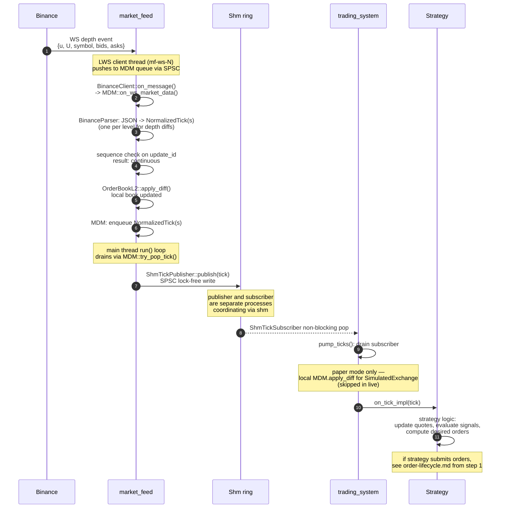

# Tick flow

**Level 4 flow.** One tick's path from Binance's WebSocket stream through `market_feed`, across the shared-memory ring, into a trading engine, and onto the strategy's `on_tick_impl`. Complements the [order lifecycle](order-lifecycle.md) — that flow shows how an order propagates outward from the engine; this one shows how the input that triggered the order got there.

## Happy path

## Branches

### Sequence gap on the market_feed side

Between steps 3 and 6, if the sequence check on `update_id` sees a discontinuity (e.g. `expected_next = 100000` but arrived diff has `U = 100005`), the gap detector fires:

- MDM sets the recovery-mask bit for that symbol.
- Diffs for that symbol are dropped until the main loop's `do_recovery_if_needed()` handles it.
- Main loop fetches a fresh REST snapshot for the affected symbol via ThreadPool, resyncs the local book, clears the bit.
- After that, publishing resumes normally.

During the gap window, the shm ring stops receiving ticks for that symbol. Downstream engines see no ticks arriving; their `TickStalenessWatchdog` starts a warning timer. Recovery usually completes within seconds. If it doesn't, MARKET_DISCONNECT trip conditions eventually apply on the engine side.

### Slow subscriber (ring overwrite)

The shm ring is SPSC lock-free with capacity 65536. If the trading engine can't drain fast enough (a stalled `pump_ticks` loop, or one engine drastically slower than the publisher), the publisher wraps and starts overwriting the oldest ticks. The engine detects this via a sequence-number gap on the subscriber side: subscribed seq `N`, next tick delivers seq `N + K` where K > 1.

Engine treats this the same as a market_feed gap — the ticks for that range are gone forever, so it triggers a REST snapshot recovery on the affected symbols to resync its own view. No cross-container coordination needed — each side detects loss independently.

### Multiple engines, same shm ring

The ring is SPSC (single-consumer per subscriber), but *multiple* engines each open their own `ShmTickSubscriber` against the same ring name. Each subscriber tracks its own read position; they don't share progress. This is why an engine dying or being slow doesn't affect other engines subscribed to the same symbol — the publisher doesn't know or care how many subscribers exist.

Trade-off: this design assumes the fast engine keeps up. A permanently-slow engine on a busy symbol will spend most of its time in recovery. Fine for the current architecture; would need a different pattern (per-consumer queues, or multi-writer ring) if that stopped being acceptable.

### Trade tick vs depth tick

The diagram shows a depth event. Trade events go through a slightly different path in market_feed:

- Same LWS → MDM entry.
- BinanceParser produces one `NormalizedTick` per trade event (not one per level like depth).
- Trade goes into the **Trade reorder buffer** (10 ms window) before reaching the recorder / publisher — Binance's matching engine is sharded and can deliver trade IDs slightly out of order.
- After the reorder window, publish is identical.

Engine side, `on_tick_impl` receives both depth and trade ticks (tagged by type). Strategies use them differently — depth drives quoting; trades drive fill / adverse-selection signals.

## What's NOT in this flow

- Bootstrap — how a symbol's book gets into a state where diffs make sense in the first place. See planned [bootstrap flow](README.md).
- What happens after `on_tick_impl` returns and the strategy submits an order — that's the [order lifecycle](order-lifecycle.md).
- Order book internals inside MDM — that's inside `OrderBookL2<N>`, documented at a marketdata component level (TBD).

## Timing budget

At retail-broker latency, the local hot path here is dominated by memory operations and small syscalls:

| Segment | Budget |
|---------|--------|
| Binance WS → LWS callback | asymmetric, network-bound (few ms typical, not measurable from our side) |
| LWS callback → SPSC push | sub-µs |
| MDM parse + book apply | few µs (JSON parse dominates) |
| MDM queue → shm publish | sub-µs |
| Shm publisher → subscriber visibility | sub-µs (cache-coherent memory) |
| Subscriber pop → strategy on_tick | sub-µs |
| **Total local hot path** | **~few µs Binance-to-strategy on this host** |

Which means end-to-end tick latency is entirely dominated by the network path from Binance to us. Local processing is a rounding error against internet RTT.

## Related

- [market-feed components](../02-components/market-feed.md) — where the LWS-to-shm pipeline lives.
- [trading-engine components](../02-components/trading-engine.md) — where ShmTickSubscriber, pump_ticks, and Strategy live.
- [order lifecycle flow](order-lifecycle.md) — what happens when the strategy submits an order in response to a tick.
- Bootstrap flow (TBD).
- WS gap recovery flow (TBD).
