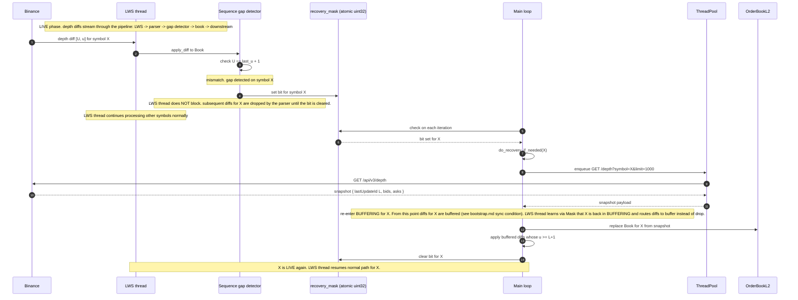

# WS gap recovery

**Level 4 flow.** How the system detects a mid-flight discontinuity in the WS depth stream and rebuilds the affected book. Uses the same protocol as [initial bootstrap](bootstrap.md) — the difference is the trigger (a sequence-check failure during LIVE, not the natural startup path) and the fact that the LWS thread must never block while recovery runs.

Referenced from [tick-flow.md](tick-flow.md) as a branch case; documented here as the full sequence including the lock-free coordination between LWS thread and main loop.

## The problem being solved

The depth stream from Binance sometimes drops or reorders messages under load or during venue-side maintenance. The sequence check on the depth path detects this by comparing incoming `[U, u]` against `previous u + 1`. When they don't line up, the local book is stale — it can't safely apply the new diff (there's a hole between the last applied update and the incoming one). Recovery has to fetch a fresh snapshot and re-sync the book, without stopping the LWS thread from processing other symbols.

## Sequence

## Why the LWS thread never blocks

The LWS thread services every group's WS session. Blocking it — even briefly — pushes back on libwebsockets' event loop and can cause other symbols in the group to fall behind, potentially triggering their own sequence gaps in a cascade.

The `recovery_mask_` design is specifically for this: it's an atomic `uint32` where each bit represents a symbol. Setting a bit is one atomic write, no lock, no allocation. Reading the bit is a similarly cheap load. The LWS thread's role in recovery is just: notice the gap, set the bit, drop or buffer diffs for that symbol depending on phase, keep processing everything else.

Main loop does the actual work — REST fetch, book replacement, buffer flush — none of which is on the LWS critical path.

## Two ways diffs for the affected symbol are handled during recovery

Depending on how the pipeline is wired:

- **Drop mode** — LWS thread's parser sees the bit set, drops all incoming diffs for that symbol until the bit clears. Recovery replaces the book entirely from the snapshot (plus buffered diffs the main loop kept). This is simplest but loses information — any diff that arrived during the recovery window is gone. Fine for feed_archiver's `Local Tick Archive` (the archive gets a gap; backtests know about it) but suboptimal for market_feed where the engine's book might be missing ticks in the interim.
- **Buffer mode** — same as initial bootstrap: incoming diffs for the affected symbol go into a per-symbol buffer. When the snapshot arrives, the buffered diffs are drained (subject to the sync condition described in [bootstrap.md](bootstrap.md)). This is what market_feed uses so downstream engines don't lose depth events during recovery.

The `recovery_mask_` bit tells the LWS thread which mode to use — the phase field in `FeedContext` carries the semantic (BUFFERING vs LIVE for that symbol), and the LWS parser reads that on the fly.

## Timing

Recovery is bounded by the REST snapshot RTT to Binance (typically hundreds of milliseconds under normal conditions). During recovery:

- The affected symbol has no live ticks reaching downstream consumers.
- Downstream engines will see ticks for that symbol stop advancing.
- `TickStalenessWatchdog` starts a warning timer. If recovery completes within the threshold, warning clears.
- If recovery persistently fails (multiple REST retries, or the sync condition can't be satisfied), the group is killed — same escalation as bootstrap failure. See [bootstrap.md](bootstrap.md).

## Failure modes

| Failure | Behavior |
|---------|----------|
| REST snapshot fetch fails | ThreadPool task returns error. Main loop logs, retries with backoff. Persistent failure escalates to group kill. |
| Sync condition can't be met (buffered diffs all pre-date snapshot's L+1) | Refetch snapshot. If it still fails after a few attempts, escalate to group kill. |
| Gap detector fires again during recovery | Recovery is already in progress for the symbol; the mask bit is already set. New "gap detected" events are effectively idempotent. |
| Recovery takes long enough to trip TickStalenessWatchdog | Downstream engine trips `MARKET_DISCONNECT`. Engine goes through [KillSwitch cascade](killswitch-cascade.md). |

## Related

- [tick-flow](tick-flow.md) — the sequence-gap branch that entrypoints this flow.
- [bootstrap](bootstrap.md) — same protocol, different trigger. Recovery is bootstrap re-entered mid-flight.
- [feed-archiver components](../02-components/feed-archiver.md) — where the gap detector and recovery_mask live.
- [market-feed components](../02-components/market-feed.md) — same components on the live-trading side.
- [KillSwitch cascade](killswitch-cascade.md) — what happens on the engine side if recovery drags out past the staleness threshold.
